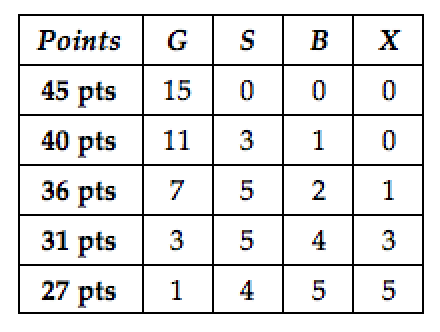

<style>
h1{font-weight: 400;}
</style>

```{r setup, include=FALSE}
knitr::opts_chunk$set(
  echo=TRUE, 
  message=FALSE, 
  warning=FALSE, 
  eval=FALSE, 
  fig.width=16/2, 
  fig.height=9/2
)
library(tidyverse)
library(gapminder)
library(patchwork)
```

<!--
{target="_blank"}
-->

***


# Badge Challenge System

There will be four "badge challenges," three mid-semester and one during finals week, during which you can collect statistics "badges." There are a total 15 badges, each representing a core skill for the course. Note: The coloring of the badge challenges matches the coloring of the lecture schedule.

<iframe src="https://docs.google.com/spreadsheets/d/e/2PACX-1vQM-5FVt5BKJZsfElEV19NwD2MXGgSVUfGLB7dUoD0MbCU6Dkzqx66UMxbgqMaiS6H8CP8numV5Xaf-/pubhtml?gid=67598343&amp;single=true&amp;widget=true&amp;headers=false" width="100%" height="550"></iframe>

As you can see, the first badge challenge will have the first 5 badges available, the second will have the first 10, and the third and fourth badge challenge will have all 15 badges. During each badge challenge, you can attempt as many or as few of the available badges as you would like. **Your goal, by the end of the semester, is to collect all 15 badges.** 

There are four levels for each badge: *G* – Gold, *S* – Silver, *B* – Bronze, and *X* – cannot be assessed. The most recent level for each badge is the recorded level. This means that if you earn a gold level for badge 1 on the first challenge, then you never have to attempt this badge again. But, if you earn silver for badge 4 on the first challenge and then a bronze for badge 4 on the second challenge, your current level for badge 4 is bronze. **Thus, you do not need to (nor should you) attempt all badges on each challenge,** but you do need to collect all 15 badges by the end of the term.

At the end of the semester, your collected badges and badge levels will be converted into points for the 45% of your final grade assigned to badge challenges (see [syllabus](syllabus.html#evaluation)):



**Why are we doing this?**

1. To remove the pressure, stress, and performance anxiety associated with conventional exams. The "badge challenge" system *guarantees* more than one chance to **master** each badge.
1. The "badge challenge" system system allows for you to iteratively improve your statistical skills throughout the semester. Each badge challenge is an opportunity for you to practice the *only* the statistical skills that you are ready to demonstrate. For example, if you've already **mastered** a particular badge, you can focus your studying elsewhere in a targeted fashion.
1. Since you are given the opportunity to **master** all 15 badges after the first three badge challenges, the fourth badge challenge during exam week becomes merely an opportunity to revise and improve your grade.
1. The "badge challenge" system is aligned with the **mastery**-based learning pedagogical paradigm, which encourages a ["growth mindset"](https://hapara.com/blog/mastery-based-grading/){target="_blank"} as opposed to a minimum/fixed mindset. 

<!--
Sell it informally as:

* Chart your own journey
* Pokemon: gotta catch them all
-->


***


# Badge Challenge I {#challengeI}

## Administrative notes

* Time window: **Friday 2/28 5pm through Monday 3/2 11pm**. In order to ensure fairness, all instructors, lab instructors, and Spinelli tutors will not answer questions about the badge challenge during this time window.
* In preparation for badge challenge:
    + Look at the [cover page](static/BC1_cover_page.pdf){target="_blank"}
    + Especially if you have never taken a Seelye Self-scheduled exam before, read the [instructions](http://www.science.smith.edu/self-scheduled-exam-printing/){target="_blank"} beforehand
    + Bring colored pencils/pens
    + All Office of Disability Services forms must be submitted to instructor in print before the start of the time window
* Printing the badge challenge: From a macOS computer in Seelye basement during the time window
    + Access the link to print the badge challenge on Moodle
    + Print badge challenge **in color**
    + At some point you'll need to wait 5-10 seconds for a "paper is held in queue" pop-up box to appear before you can print
* During badge challenge:
    + Closed-book, no internet, and individually completed
    + Remember that you only have to do as many questions as you are ready for. If a question has multiple parts, you **must** attempt all parts to earn above *X* (cannot be assessed). 
    + You will be given 140 mins to complete it (including transit time to writing area). **Timestamps will be strictly enforced. Any badge challenges with pairs of timestamps indicating than more than 140 minutes or missing timestamps are subject to an honor board case.**
* After badge challenge:
    + You are prohibited by the Honor Code from discussing the badge challenge until the end of the time window.


## Badges 1-5

### Topics

Everything we have done so far in this class is mapped to Badges 1-5 in the above table of 15 badges. In other words, everything up to and including regression with a categorical explanatory variable. Just like with the Grammar of Graphics where you map variables to aesthetics attributes, map everything we've done in class so far to one of 5 badges. By "everything" we mean:

1. Lectures 1-12: Content on course webpage for each lecture along with in-class notes
1. All the ModernDive readings in the course schedule along with learning checks (solutions are in Appendix-D of ModernDive)
1. Labs 1-4 and corresponding PS01-PS04

### How to study and take badge challenge

After you've done this, create a priority of badges from most to least comfortable, and plan to do the questions in that order during the badge challenge. That way you can demonstrate your strongest statistical knowledge first, lock those badges in, then with time permitting move on to attempt badges relating to your areas for development. Our past experience has shown that those students who:

1. First attempted 4 out of 5 badges then
1. Went back and polished their answers then
1. Attempted the remaining fifth question

often tended to catch small mistakes and thus were better able to demonstrate demonstrate badge proficiency. The badge challenge is timed such that if you have prepared adequately, we expect the majority students should be able to finish and revise 4 out of 5 questions comfortably and have sufficient time to potentially complete the remaining 5th badge.

> Remember that you only have to do as many questions as you are ready for. If a question has multiple parts, you **must** attempt all parts to earn above *X* (cannot be assessed). 

### Badge 2: What is "pseudocode"?

Badge challenge 2 is "Write pseudocode for basic data wrangling & exploratory data analysis." What is pseudocode? Think of pseudocode as a recipe, a blue print, or an algorithm outline that balances:

1. Being specific enough that someone who reads it can walk through the steps unambiguously.
1. Not being perfectly written code that necessarily works.

Code without explanation provides a limited view into your understanding. Therefore it is important to demonstrate mastery of the "what" we are doing (the recipe, blue print, outline) versus the "how" we are going to do it (actual functioning code).

In-class example:


***


# Badge Challenge II {#challengeII}

## Administrative notes

* Time window: **Friday 4/10 12:01am through Wednesday 4/15 11:59pm**
    + You can start the badge challenge after Friday 4/10 12:01am Eastern Daylight Time
    + You must submit your badge challenge before Wednesday 4/15 11:59pm Eastern Daylight Time
* Format: We will post the format and submission method for this badge challenge at the same time as Lec24 on the evening of Thursday 4/2. **We will decide on the format based on your responses to the survey posted in the "COVID-19" tab of the webpage above, which are due Tuesday 3/31 at 11pm Eastern Daylight Time.**
   
    
<!--    
* In preparation for badge challenge:
    + Designate a 3 hour window that you can dedicate to completing this badge challenge.
    + Have the following ready: colored pencils/pens, blank sheets of paper, your laptop, and a mobile phone with a camera.
    + If you haven't already, all Office of Disability Services forms must be submitted to instructor before the start of the time window.
* "Printing the badge challenge":
    + Instead of printing a timestamped copy of the badge challenge as you would in Seelye, you will click a link on Moodle to "start" the exam. We will use Moodle's internal timestamp logs to determine when you "started" your badge challenge
    + You do not need to physically "print" the badge challenges.
* "Completing the badge challenge":
    + You will write you answers down on your blank sheets of paper.
    + Remember that you only have to do as many questions as you are ready for. If a question has multiple parts, you **must** attempt all parts to earn above *X* (cannot be assessed).
* "Submitting the badge challenge":
    + You will submit your badge challenge on Gradescope as you would for a problem set. We will use the Gradescope submission timestamp to determine when you "submitted" your badge challenge.
* Honor code:
    + Closed-book, no internet, and individually completed. You may only use your laptop to view the badge challenge
    + You will be given 3 hours to complete it. **Timestamps will be strictly enforced. Any badge challenges with pairs of timestamps indicating that more time than allowed was taken will be subject to an honor board case.**
    + You are prohibited from discussing the badge challenge with your peers during the time window. 
-->


## Badges 1-10
    
* Badges: Lectures 1-24 & problem sets 1-7.  In other words everything up to resampling and not confidence intervals.
* What to study:
    + Badge challenge 1!
    + Your hand-written course notes first: they are the "executive summaries" of topics.
    + The material on the course webpage chronologically, in particular the ModernDive readings.


***


# Badge Challenge III {#challengeIII}

## Administrative notes

* Time window: **Friday 4/24 12:01am through Wednesday 4/29 11:59pm**
    + You can start the badge challenge after Friday 4/24 12:01am Eastern Daylight Time
    + You must submit your badge challenge before Wednesday 4/29 11:59pm Eastern Daylight Time
* Format: TBD
* We will have badge challenge III graded and returned to you by the evening of Saturday 5/2 so that you can study it for badge challenge IV.


## Badges 1-15
    
* Badges: All Lectures 1-35 & all problem sets 1-9. In other words everything.
* What to study:
    + Badge challenges 1 and 2!
    + Your hand-written course notes: they are the "executive summaries" of topics.
    + The material on the course webpage chronologically, in particular the ModernDive readings.


***


# Badge Challenge IV {#challengeIV}

## Administrative notes

* Time window: **Exam week: Monday 5/4 12:01am through Friday 5/8 11:59pm**
    + You can start the badge challenge after Monday 5/4 12:01am Eastern Daylight Time
    + You must submit your badge challenge before Friday 5/8 11:59pm Eastern Daylight Time
* Format: TBD

## Badges 1-15
    
* Badges: All Lectures 1-35 & all problem sets 1-9. In other words everything.
* What to study:
    + Badge challenges 1, 2, and 3!
    + Your hand-written course notes: they are the "executive summaries" of topics.
    + The material on the course webpage chronologically, in particular the ModernDive readings.

