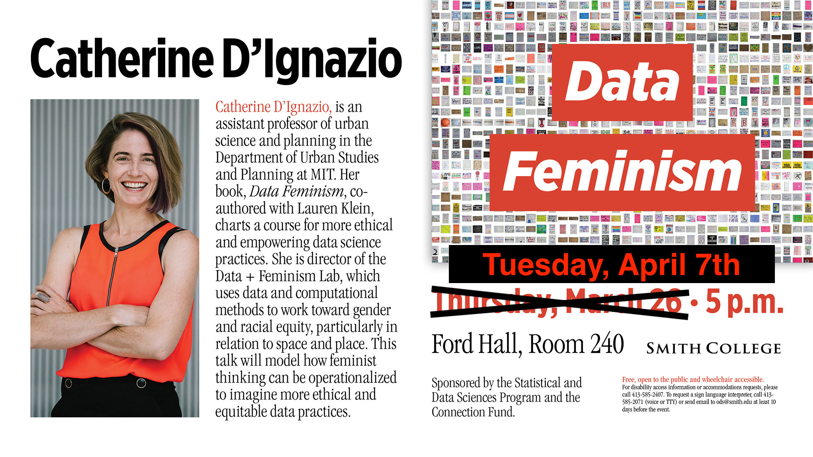
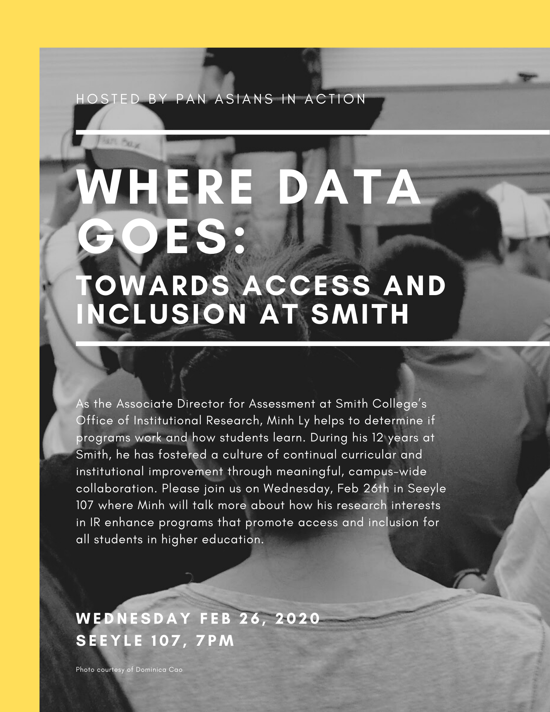

<style>
h1{font-weight: 400;}
</style>

```{r setup, include=FALSE}
knitr::opts_chunk$set(
  echo=TRUE, 
  message=FALSE, 
  warning=FALSE, 
  eval=FALSE, 
  fig.width=16/2, 
  fig.height=9/2
)
library(tidyverse)
library(lubridate)
library(stringr)
library(forcats)
library(moderndive)

# Formating packages:
library(knitr)
library(kableExtra)
library(scales)

# Data packages:
library(fivethirtyeight)
library(nycflights13)
library(gapminder)
library(babynames)

# Etc
library(here)
library(patchwork)

# Set seed value of random number generator to get "replicable" random numbers.
set.seed(76)

# Example points for boxplots
example <- tibble(
  values = c(1, 3, 5, 6, 7, 8, 9, 12, 13, 14, 15, 30)
)

# fruit basket example for data wrangling
fruit_basket <- tibble(
  type = c("mango", "kiwi", "mango", "grape", "grape", "mango"),
  `price in $` = c(2, 3, 1, 3, 1, 3)
)

# simple regression example
simple_regression_ex <- tibble(
  x = c(0, 0.5, 1),
  y = c(2, 1, 3)
)

# Note to future self: Changes y = value to something with context. Also saying
# "the fitted value for value" is awkweird
categ_regression_ex <- tibble(
  name = c("Bert", "Bert", "Bert", "Florence", "Florence", "Florence", "Katie", "Katie", "Katie"),
  value = c(9, 10, 11, 11, 12, 13, 8, 9, 10)
)
```


***


# Schedule 

<iframe src="https://docs.google.com/spreadsheets/d/e/2PACX-1vQM-5FVt5BKJZsfElEV19NwD2MXGgSVUfGLB7dUoD0MbCU6Dkzqx66UMxbgqMaiS6H8CP8numV5Xaf-/pubhtml?gid=1148404917&amp;single=true&amp;widget=true&amp;headers=false" width="100%" height="925"></iframe>

<!--
{target="_blank"}
-->


<!--
Notes to future self:

- Every two weeks: a holistic, cummulative, synthesis that ties in more with 
badge challenge than project. On paper, like the "debugging" exercise Lec13
- 
-->


***


# Lec 26: Wed 4/8

## Announcements

1. NA


## Chalk Talk

1. Watch this mini-lecture on interpreting confidence intervals
<center>
<iframe src="https://www.showme.com/sh?h=Vg828zg" width="578" height="433" frameborder="0"></iframe>
</center>
1. Then read sections 8.5 in our book. Remember to carefully work the code pieces just as if you were in live class with us. 


## Discussion Sessions

1. There are 4 Zoom discussion sessions between Wed 4/8 and Thurs 4/9. They are listed on [this Google Calendar](https://calendar.google.com/calendar/embed?src=smith.edu_qd5sufjufbms2430ielqeego24%40group.calendar.google.com&ctz=America%2FToronto){target="_blank"}. Please add this calendar to your own calendar!
1. Be sure to set the "time zone" in your own Google Calendar to match your location so that the appointment times appear correctly for you. For reference, Will Hopper's Wed 4/8 session is between 9:00am - 10:30am Eastern.


## Getting More Help

1. Ask questions in the `#questions` channel on Slack!
1. To schedule a one-on-one appointment with a Spinelli Tutor, visit their [self-scheduled appointment calendar](https://calendar.google.com/calendar/selfsched?sstoken=UUU0UTRmUnpvVmhIfGRlZmF1bHR8OTk2MWU3M2M2NmI1NjhiODdjMzhiZjVhM2Q1Yjg5NDc){target="_blank"}. Be sure to set the "time zone" in your own Google Calendar to match your location so that the appointment times appear correctly for you. 


***


# Lec 25: Mon 4/6

## Announcements

1. Please read the updated [implementation notes for the Badge Challenges](https://smithcollege-sds.github.io/SDS220/badge_challenges.html#challenge-format){target="_blank"} and ask questions on the #remote_learning Slack channel
1. Spinelli center tutoring is up and running! See the "Getting More Help" section below for more information.


## Chalk Talk

1. Watch this mini-lecture tying bootstrap distributions to the computations of Confidence Intervals 

<center>
<iframe src="https://www.showme.com/sh?h=Vg828zg" width="578" height="433" frameborder="0"></iframe>
</center>
1. Then read sections 8.3 and 8.4 in our book. Remember to carefully work the code pieces just as if you were in live class with us. 
1. A question to ponder (as you watch the video and read the sections) is "How does the bootstrap distribution approximation of the sampLING distribution strengthen what your one sample can do?"

## Discussion Sessions

1. There are 4 Zoom discussion sessions between Mon 4/6 and Tues 4/7. They are listed on [this Google Calendar](https://calendar.google.com/calendar/embed?src=smith.edu_qd5sufjufbms2430ielqeego24%40group.calendar.google.com&ctz=America%2FToronto){target="_blank"}. Please add this calendar to your own calendar!
1. Be sure to set the "time zone" in your own Google Calendar to match your location so that the appointment times appear correctly for you. For reference, Will Hopper's Fri 4/3 session is between 9:00am - 10:30am Eastern.


## Getting More Help

1. To schedule a one-on-one appointment with a Spinelli Tutor, visit their [self-scheduled appointment calendar](https://calendar.google.com/calendar/selfsched?sstoken=UUU0UTRmUnpvVmhIfGRlZmF1bHR8OTk2MWU3M2M2NmI1NjhiODdjMzhiZjVhM2Q1Yjg5NDc){target="_blank"}.
1. Be sure to set the "time zone" in your own Google Calendar to match your location so that the appointment times appear correctly for you. For reference, Chichi's first Mon 4/6 appointment block is between 9:30am – 10:15am eastern.


***


# Lec 24: Fri 4/3

## Announcements

1. We have read all your survey responses. If anything changes about your living situation or learning environment, please be proactive and let us know ASAP!
1. Spinelli center tutoring is up and running! See the "Getting More Help" section below for more information.


## Chalk Talk

1. In preparation, have the following figures and tables ready in separate tabs in your browser:
    1. ModernDive Figure 7.15 comparing three sampl-ING distributions of $\widehat{p}$ based on samples of size $n$ = 25, 50, and 100.
    1. ModernDive Table 7.5 on difference scenarios for sampling for (statistical) inference
1. Watch this mini-lecture. Note at 17m54s it is a little longer than you can expect this semester as I both recapped Ch7 on Sampling and was getting used to the tech.  
<center>
<iframe src="https://www.showme.com/sma/embed/?s=HxoE3cm" width="578" height="433" frameborder="0"></iframe>
</center>
1. Read from the beginning of Chapter 8 up to and including 8.2 in our book. Click the "ModernDive" tab above to ensure you're reading the right version of the book.


## Discussion Sessions

1. There are 4 Zoom discussion sessions between Fri 4/3 and Sun 4/5. They are listed on [this Google Calendar](https://calendar.google.com/calendar/embed?src=smith.edu_qd5sufjufbms2430ielqeego24%40group.calendar.google.com&ctz=America%2FToronto){target="_blank"}. Please add this calendar to your own calendar!
1. Be sure to set the "time zone" in your own Google Calendar to match your location so that the appointment times appear correctly for you. For reference, Will Hopper's Fri 4/3 session is between 9:00am - 10:30am Eastern.


## Getting More Help

1. To schedule a one-on-one appointment with a Spinelli Tutor, visit their [self-scheduled appointment calendar](https://calendar.google.com/calendar/selfsched?sstoken=UUU0UTRmUnpvVmhIfGRlZmF1bHR8OTk2MWU3M2M2NmI1NjhiODdjMzhiZjVhM2Q1Yjg5NDc){target="_blank"}.
1. Be sure to set the "time zone" in your own Google Calendar to match your location so that the appointment times appear correctly for you. For reference, Chichi's first Fri 4/3 appointment block is between 9:30am – 10:15am eastern.


***


# Lec 23: Wed 4/1

## Announcements

1. Please read the announcements from Mon 3/30

## Chalk Talk

1. Watch this [mini-lecture](https://www.showme.com/sh?h=ZtNEJea){target="_blank"} connecting Monday's class to today's topic. 
2. Then read sections 7.5 and 7.6 in our book.
3. Today's big idea is the Central Limit Theorem!!!

## Discussion Sessions

There are 4 discussion sessions between 4/1 and 4/2. They are listed on [this Google Calendar](https://calendar.google.com/calendar/embed?src=smith.edu_qd5sufjufbms2430ielqeego24%40group.calendar.google.com&ctz=America%2FToronto){target="_blank"}. Please add this calendar to your own calendar! 


***


# Lec 22: Mon 3/30

## Announcements

* Add the sds-mth-220-2020-01.slack.com workspace to your Desktop or Mobile version of Slack.
* Please _carefully_ read the following updated tabs of the course webpage: "COVID-19" (if you haven't already read our update from Friday 3/27), "Badge Challenges", "Project", and "Syllabus". If anything isn't clear, please ask us in the `#questions` channel in Slack.
* Please ensure you are doing the readings from the <https://moderndive-bert.netlify.com/> version of the book i.e. there should be a "-bert" in the link. For example, clicking the "ModernDive" tab of this webpage will take you to the correct version of the book.


## Chalk Talks

1. Watch this [mini-lecture](https://www.showme.com/sh?h=nt6tx4K){target="_blank"} connecting Monday's class from before spring break to now. Then read sections 7.3 and 7.4 in our book.
2. Watch this [bonus mini-lecture](https://www.showme.com/sh?h=qfDITQW){target="_blank"} on SampLING distributions. 

## Discussion Sessions

There are 4 discussion sessions between 3/30 and 3/31. They are listed on [this Google Calendar](https://calendar.google.com/calendar/embed?src=smith.edu_qd5sufjufbms2430ielqeego24%40group.calendar.google.com&ctz=America%2FToronto){target="_blank"}. Please add this calendar to your own calendar! 


***


# Lec 21: Fri 3/13

## Announcements

1. Practice-run of Zoom lecture format
1. Went over COVID-19 preparations


***


# Lec 20: Wed 3/11

## Announcements

1. Acknowledgement of situation
1. Issue of communication
1. Slack:
    1. No more browser-based version, install Desktop App or Mobile App
    1. Add `#remote_learning` channel: Post questions/comments specifically about remote learning technology here.
    1. Setting notifications
1. COVID-19 tab of webpage:
    1. "Remote Learning Preparedness Survey"
    1. Go over components of course
1. Zoom
    1. Login to meeting as practice run for lectures
    1. Practice creating meetings in groups
    1. Practice screensharing
1. Questions (to be posted on COVID-19 tab of webpage)


***


# Lec 19: Mon 3/9

## Announcements

1. Project proposal due today at 11pm. Spinelli tutors (who have all taken SDS 192 Introduction to Data Science) are available tonight 7-9pm in Sabin-Reed 301.


## Recap

1. Last time, we did "tactile" simulations with our hands using a shovel with $n$ = 50 slots to extract samples from the bowl.
1. For each sample, you [generated estimates](https://docs.google.com/spreadsheets/d/14iWUKc-lBY8U_hs4Fng50oT43yGQZsgZjrVh7ZtF9VI/edit#gid=0){target="_blank"} of the proportion of the bowl's balls that are red.
1. Note: In ModernDive 7.1, 33 groups of Amherst College students took samples from a bowl with slightly different contents.


## Chalk Talk

1. Chalk talk part I:
    1. Mimic the "tactile sampling using a tactile shovel" from Lec18 on Friday with "virtual sampling using virtual shovel": the `rep_sample_n()` function, which uses your computer's [random number generator](https://en.wikipedia.org/wiki/Random_number_generation){target="_blank"}.
    1. Example: `rep_sample_n(size = 50, rep = 33)`
1. Reading part I
    1. 7.2 up to the end of 7.2.2
1. Chalk talk part II:
    1. Break down the data wrangling needed to create the data frame visualized in Figure 7.10: Histogram of 1000 proportion reds
1. Readings part II
    1. 7.3 & 7.4. In particular, compare Figure 7.12 and Table 7.1
    


***


# Lec 18: Fri 3/6

## Announcements

1. FYI: You will not be penalized for missing class due to illness.
1. Project proposal due on Monday 11pm. Spinelli tutors (who have all taken SDS 192 Introduction to Data Science) are available on Sunday and Monday 7-9pm in Sabin-Reed 301.

## Recap

1. `NA`

## Chalk Talk

1. In-class activity


***


# Lec 17: Wed 3/4

## Announcements

<center>
{ width=100% }
</center>

## Recap

1. `NA`


## Chalk Talk

1. In-class activity! 
1. Chalk talk only today (no coding)

<!--
Private: detailed notes for this "random assignment for causal inference" lecture can be found

1. On [Google Docs](https://docs.google.com/document/d/1o761ogcEw7_T82Q84X3kHZFy1dzYxmmS34xG8rrcjpM/edit)
1. In this [PDF](static/2020-03-04_Lec18_Notes_ Random_Assignment_for Causal_Inference.pdf)

The code to create the boxplot can is here:
-->
```{r, echo=FALSE, eval=FALSE}
library(tidyverse)
africa_data <- "static/africa_results.csv" %>% 
  read_csv() %>% 
  mutate(
    # priming_number = if_else(priming_number == "Primed with 14 countries", "14 countries", "94 countries"),
    been_to_africa = if_else(been_to_africa == "No", "Never been to Africa", "Been to Africa")
  )

stat_box_data <- function(y, upper_limit = max(africa_data$how_many_countries) * 1.15) {
  return( 
    data.frame(
      y = 0.95 * upper_limit,
      label = paste("n =", length(y))
    )
  )
}

plot <- ggplot(africa_data, aes(x = priming_number, y = how_many_countries)) +
  geom_boxplot() +
  labs(x = "Priming Group", y = "Number of countries in Africa guessed",
       title = "Results from previous section of SDS 220") +
  stat_summary(
    fun.data = stat_box_data, 
    geom = "text", 
    hjust = 0.5,
    vjust = 0.9
  )
ggsave("static/images/africa_results.png", width = 16/1.5, height = 9/1.5)


ggplot(africa_data, aes(x = priming_number, y = how_many_countries)) +
  geom_boxplot() +
  labs(x = "Priming Group", y = "Number of countries guessed") +
  facet_wrap(~been_to_africa) +
  stat_summary(
    fun.data = stat_box_data, 
    geom = "text", 
    hjust = 0.5,
    vjust = 0.9
  )
ggsave("static/images/africa_results_with_confounders.png", width = 16/1.5, height = 9/1.5)
```


***


# Lec 16: Mon 3/2

## Announcements

1. Badge challenge 1 is still going on. The honor code prohibits you from discussing it until the time window closes.


## Chalk Talk

1. Model selection using visualizations. In particular, choosing between the interaction and parallel slopes models by comparing
    1. Figure 6.7 for UT Austin data
    1. Figure 6.8 for Massachusetts high school data
1. Model selection using $R^2$. In particular, choosing between the interaction and parallel slopes models by comparing $R^2$ values


***


# Lec 15: Fri 2/28

## Announcements

1. Project
    1. Go over [general feedback](project.html#phase_I_feedback) for all groups
    1. Discuss next project phase: project proposal
1. Cover page of Badge Challenge I is now [posted](static/BC1_cover_page.pdf){target="_blank"}

## Recap

1. Interaction models are one type of model for $x_1$ numerical and $x_2$ categorical (with $k$ levels/groups). They
    1. Allow for different intercepts for all $k$ groups
    1. Allow for different slopes for all $k$


## Chalk talk

1. Parallel slopes models are another type of model for $x_1$ numerical and $x_2$ categorical (with $k$ levels/groups). They
    1. Allow for different intercepts for all $k$ groups of the categorical variable $x_2$
    1. Restrict all $k$ groups to have a common slope
1. On Monday, we'll explore model selection


***


# Lec 14: Wed 2/26

## Announcements

* Project: We're going over first phase submissions as we speak. We'll have first round of feedback and information for the next project phase on Friday.
* Badge Challenge 1:
    + Remember that you only have to do as many questions as you are ready for. If a question has multiple parts, you **must** attempt all parts to earn above *X* (cannot be assessed). 
    + In order to ensure fairness, all instructors, lab instructors, and Spinelli tutors will not answer questions during the badge challenge time window.
    + We'll post the cover page of the badge challenge on the webpage later today.
* Minh Ly, the Associate Director for Assessment of [Smith Office of Institutional Research (IR)](https://www.smith.edu/about-smith/institutional-research){target="_blank"}, will be giving a talk this tonight at 7PM in Seelye 107:

<center>
{ width=50% }
</center>

## Recap

* Indicator function from ModernDive 5.2.2 on regression with a categorical variable using `gapminder` data. What does $\mathbb{1}_{\text{Amer}}(x)$ do?

## Chalk talk

Today's outline:

1. Chalk talk part 1: Multiple regression for $y$ as a function of $x_1$ and $x_2$
1. You will then read ModernDive from the beginning of Chapter 6 to the end of 6.1.1. Write down your interpretation of Figure 6.1.
1. Chalk talk part 2: Tying together
    1. Figure 6.1: Visualization of interaction model
    1. Table 6.2: Regression table for interaction model
    1. Table 6.4: Intercepts and slopes of regression line for both genders (recorded as binary at time of study in 2005). 
1. You will then read ModernDive 6.1.2 on interaction models


***


# Lec 13: Mon 2/24

## Announcements

1. [SDS talk this week](https://smithcollege-sds.github.io/sds-www/speaker_Hu.html#public_lecture:_generating_synthetic_family_income_for_the_consumer_expenditure_surveys){target="_blank"} on balancing between "having useful data" and "maintinaing sufficient privacy protection":
    + What: "Generating Synthetic Family Income for the Consumer Expenditure Surveys"
    + Who: Prof. Jingchen (Monika) Hu, Vassar College
    + When: Thursday Feb 27, 5pm
    + Where: McConnell Hall 103

<center>
{ width=75% }
</center>

## Today

* Recap exercise on common R and RStudio coding issues (print-out given in class available [here](https://docs.google.com/document/d/1tvjDIZXlrQMaYKmv9omWkmIpi-2w3NPxGpNXlSktgNY/){target="_blank"})
* Discussion on [Badge Challenge 1](badge_challenges.html#)
* Class time for projects


***


# Lec 12: Fri 2/21

## Announcements

* `NA`

## Recap

Recall the `categ_regression_ex` data frame from from Lec11. Note that the explanatory variable $x$ = name is now categorical with 3 levels: Bert, Florence, Katie.

```{r, echo=FALSE, eval=TRUE}
categ_regression_ex
```

You then plotted the points. Let's also add three lines:

1. A solid line for Bert's "baseline" mean ("Bert" is the baseline because it comes first alphanumerically)
1. A dashed line for Florence's mean, which is *offset* from Bert's mean by 12 - 10 = +2
1. A dotted line for Katie's mean, which is *offset* from Bert's mean by 9 - 10 = -1

```{r, eval=TRUE, echo=FALSE}
ggplot(data = categ_regression_ex, mapping = aes(x=name,y=value)) +
  geom_point() +
  geom_hline(yintercept = 10) +
  geom_hline(yintercept = 12, linetype = "longdash") +
  geom_hline(yintercept = 9, linetype = "dotted")
```

Shout out to [Dr. Jenny Smetzer](https://www.scsparkscience.org/fellow/jennifer-smetzer/){target="_blank"} for this example.


## Chalk talk

Now let's obtain the *regression table* using the `get_regression_table()` function in the `moderndive` package. Recall this is done in two steps:

```{r, eval = TRUE}
# Step 1: Fit regression model
model_ex <- lm(value ~ name, data = categ_regression_ex)

# Step 2: Get regression table
get_regression_table(model_ex)
```


<!--
Then write on board (in order to bridge the gap between output of regression
table & wacked out indicator function notation they'll read in Chapter 5.2.2
today):

1. Make a separate table of name on rows, and nameFlorence and nameKatie in columns, populate with 0's & 1's
1. Write out equation of "line" in terms of regression table output:
    + `value = intercept + nameFlorence + nameKatie`.
    + Do all three cases
1. Write out equation of line via math and with indicator functions:
    + Explain what indicator function is $1_{Florence}(x)$
    + $\widehat{y} = b_0 + b_{Florence}\cdot 1_{Florence}(x) + b_{Katie}\cdot 1_{Katie}(x)$
    + We need this notation in particular for multiple regression in Chapter 6
--> 

Let's now get the fitted values and residuals using the `get_regression_points()` function on `model_ex` (where our model is saved):

```{r, eval = TRUE}
# Step 2: Get regression points
get_regression_points(model_ex)
```

<!--
Then write on board:

1. When x is categorical y-hat fitted values correspond to group means for each level:
    + Bert: Just 10
    + Florence: 10 + 2 = 12
    + Katie: 10 - 1 = 9
1. Compute a few residuals and show they correspond to deviations/errors from the group means

Note for future self: Make sure to talk about interpretation of the values in estimate column of table in context of example.

Note for future self:
- x numerical: for every slide of 1 in x, the slope is the expected/on average change in y (not necessarialy causal)
- x categorical: for a hop between categories starting from the baseline
-->


    
    
<!--    
If mental bandwidth exists, add to ModernDive -> Chapter 5.2.2 -> a visualization of what the terms in the regression table in Table 5.8 actually mean. Do this in  [moderndive_book](https://github.com/moderndive/ModernDive_book/) repo -> `bert-dev` branch -> Open `05-regression.Rmd` and edit, commit, and push this file only. The book builds and deploys automatically using Netlify

* A jitterplot of x = continent, y = lifeExp, mark baseline, mark means, show offsets of marked means vs baseline.
* Insert in text right before "Let’s generalize this idea a bit".
-->


***


# Lec 11: Wed 2/19

## Announcements

* `NA`

## Recap

* What are boxplots good for?

<!--
Then write on board:

1. They allow you to compare the distribution of a numerical variable (on y-axis) split by a categorical variable (on x-axis)
1. Remember: solid line in middle is median, not mean. Both are measures of center, one is more sensitive to outliers.
1. Example: Say a company has 5 employees with hourly salary: 10, 10, 10, 10, 1000. Mean hourly salary is $208. Why might mean not be appropriate?
-->

## In-class exericse

Consider the following 9 points saved in a data frame called `categ_regression_ex` where we have

1. A numerical outcome variable $y$ = `value`
1. An *categorical* explanatory variable $x$ = `name` with 3 levels: Bert, Florence, Katie.

```{r, eval=TRUE}
library(ggplot2)
library(dplyr)
categ_regression_ex <- tibble(
  name = c("Bert","Bert","Bert","Florence","Florence","Florence","Katie","Katie","Katie"),
  value = c(9,10,11,11,12,13,8,9,10)
)
categ_regression_ex
```

In groups: copy the above code and create a scatterplot with

1. `value` (numerical) on the y-axis
1. `name` (categorical) on the x-axis

Note this is slightly different that the scatterplots we've seen until now where the x variable was always numerical.

```{r, echo=FALSE, eval=FALSE}
# This code is hidden. Maybe a live coding demo?
ggplot(categ_regression_ex, aes(x = name, y = value)) + 
  geom_point()
```

**Solution**:

```{r, eval=TRUE, echo=TRUE}
ggplot(data = categ_regression_ex, mapping = aes(x=name,y=value)) +
  geom_point()
```

<!--
Then draw the above plot on board and mark:

1. mean for Bert with horizontal line. call this the baseline mean
1. mean for Florence and Katie with horizontal lines
1. both possible offsets

Why is Bert baseline? For no other reason than it's first alphanumerically.
-->


***


# Lec 10: Mon 2/17

## Announcements

* First phase of [project](project.html) is due Mon 2/24 at 11pm. If you haven't already, **start now**. 
* Will Hopper's Thursday PM lab is cancelled b/c of Rally Day. For this week only, you may attend the following labs (see [syllabus](syllabus.html) for time/place):
    + David Rockoff's Tue PM lab
    + Will Hopper's Thu AM lab

## Recap

<!--
Bert is going to another example of summarize, b/c students are confused about 
the "collapsing rows" nature of the operation.
-->

## Chalk talk

1. Correlation is not necessarily causation:
    a) [Spurious correlations](http://www.tylervigen.com/spurious-correlations){target="_blank"}
    a) What are X = treatment, Y = response, and Z = confounding variables?
    a) What are causal graphs? 
    a) Simple example: Does "X = drinking gatorade/ginger ale" cause "Y = feel nauseous"? 
    <!--Z = has the flu -->
    a) Famous example: [UC Berkeley gender bias](https://en.wikipedia.org/wiki/Simpson%27s_paradox#UC_Berkeley_gender_bias){target="_blank"}. Does "X = (binary) gender" cause "Y = decreased chance of admission to UC Berkeley in 1973"?
    <!--Z = competitiveness of admissions to department. Women tended to apply to departments with less resources and thus were more competitive, like humanities, while men tended to apply to departments with more resources and thus were easier to get into, like engineering.--> 
1. Recall `simple_regression_ex` from Lec09.  
```{r, echo=FALSE, eval=TRUE}
simple_regression_ex
```
    a) Draw the 3 points and the "best-fitting" regression line in blue.
    a) Draw the 3 *fitted values* $\widehat{y}$ using the equation for the regression line $\widehat{y} = b_0 + b_1\cdot x$
    a) Draw the 3 *residuals* $y - \widehat{y}$
    a) Compute the sum of squared residuals for this line.
    a) Draw another arbitrarily chosen line with equation $\widehat{y} = 2 - 1\cdot x$ in green.
    a) Compute the sum of squared residuals for this line and compare to previous

```{r, echo=FALSE, eval=TRUE}
ggplot(simple_regression_ex, aes(x = x, y = y)) +
  geom_smooth(method = "lm", se = FALSE, size = 0.5) +
  geom_abline(intercept = 2, slope = -1, col = "darkgreen", linetype = "dashed", size = 0.5) +
  geom_point(size = 2)
```


***


# Lec 09: Fri 2/14

## Announcements

* If you need a group for the project, please fill out the Google Form on Moodle ASAP! We're going to start making groups this weekend.

## Recap

* `tidyverse` package is an umbrella package that loads `ggplot2`, `dplyr`, `readr`, and other useful packages for data science all at once. For more info, visit [tidyverse.org/](https://www.tidyverse.org/){target="_blank"}

## Chalk talk

Consider the following 3 points saved in a data frame called `simple_regression_ex`. 
```{r, echo=FALSE, eval=TRUE}
simple_regression_ex
```

Let's plot them along with the *regression line*.

Now let's obtain the *regression table*. This is done in two steps:
```{r, eval = TRUE}
# Step 1: Fit regression model
model_ex <- lm(y ~ x, data = simple_regression_ex)

# Step 2: Get regression table
get_regression_table(model_ex)
```

* Connection between regression line and values in `estimate` column of regression table.
* Interpretation of:
    + Fitted intercept $b_0$: mathematical versus practical interpretations.
    + Fitted slope $b_1$: precise language matters!
* Obtaining a regression table takes two steps:
    + Create/fit the model using `lm()` and formula interface `y ~ x`
    + Ask for the table using `get_regression_table()` function from `moderndive` package
    
<!--
Notes on precise interpretation of fitted slope b1: For every increase of one
unit in x, it is the associated average increase in y.

* average b/c not all differences of one unit in x have exactly b1 increase in y,
rather averaged across all differences of unit in x
* associated b/c we don't want to assume a casual relationship
-->


***


# Lec 08: Wed 2/12

## Announcements

* First phase of project unveiled: Project data (due Mon 2/24 at 11pm)
* We move to Chapters 5 & 6 on data modeling with regressions
* Keyboard shortcut for `%>%`:
    + macOS: Command + Shift + M
    + Windows: Contrl + Shift + M

## Recap

{ width=50% }

Our data wrangling toolbox, which you will use for your project and for the rest of this course:

1. `filter()` rows
1. `summarize()` rows using a summary function
1. `group_by()` to group rows by the values of another variable
1. `mutate()` new variables/columns
1. `arrange()` rows in ascending (default) or `desc()`ending order
1. `select()` variables/columns
1. For more verbs, see `dplyr` cheatsheet: Go to RStudio menu bar -> Help -> Cheatsheets -> Data Transformation with `dplyr`.

<!--
Students get tripped up with difference between filter() and summarize(). The
former does not modify original rows, whereas the latter creates new ones that
are based on summary statistics.
-->


## Chalk talk

1. Correlation coefficient:
    + Definition: It is a summary statistic quantifying the strength of linear assocation. 
    + Draw examples
    + In ModernDive 5.4.1: Play "guessing the correlation game"
1. Two types of variables: outcome/response $y$ and explanatory/predictor variables $x$. For the following pairs of variables, what would be $y$ and what would be $x$ in a model?
    1. Temperature in fahrenheit vs temperature in celsius 
    1. Job salary and number of years of education
    1. Lung cancer and smoking
    1. Coffee and sleep

<!--
Next time 220 is taught: At this point in semester (Lec08-09) since students have a little context, consider doing a review of coding/computing concepts needed for this course:

- R console vs R Markdown are two different environments. i.e. when you create a variable/load a package in one, it doesn't necessarily exist in the other.
- Tackling error messages. Perhaps have a problem set where the students read error message and write down what the message is saying.
- Paired programming exercise: One student only writes, the other only asks questions.
- When getting help, steer students away from saying "This doesn't work" but rather "I did X. I got result Y. I think Z." That way we get what they're thinking better: building up to the idea of a minimally reproducible example. 
-->


***


# Lec 07: Mon 2/10

## Announcements

* Today's lecture is last of pink topics in calendar (data science). We start blue topics (regression) on Wednesday.

## Recap

## Chalk talk

* Using same fruit basket example from chalk talk in Lec 05:  
```{r, echo=FALSE, eval=TRUE}
fruit_basket
```
    1. `mutate()` new variables from existing variables: price in cents
    1. Reorder i.e. `arrange()` rows of a data frame in alpha-numerical order of a variable: in order of price. Default is ascending order, need to specify `desc()`
    1. `select()` variables/columns. Analogous to `filter()` rows.


***


# Lec 06: Fri 2/7

## Announcements

* `NA`
<!--
* Bert only: Emphasize problem set policy. "Turn in what you have."
* Bert only: Google doc exercise: https://docs.google.com/document/d/14PBmTU_wBTEI8j1lqZWFqFI3ETAD6N5qao-2ADQRTTM/edit

Write down 3 things you did for this class this week
Turn to a neighbor, come up with a list of 5 things
Then we did the google doc
-->

## Recap

<!--
* Bert only based on questions in his section: Distinguishing between
    + English use of "or" and "and" versus
    + Computer programming use of "or" and "and"
-->

## Chalk talk

* Using same fruit basket example from chalk talk in Lec 05:  
```{r, echo=FALSE, eval=TRUE}
fruit_basket
```
    1. "Summary functions" are many-to-one functions to compute "summary statistics," like `mean()` & `median()`
    1. Using summary functions to then `summarize()` rows
    1. Setting "group meta-data" of a data frame using `group_by()`, then `summarize()` rows. In other words, `group_by()` by itself does not change the "data", rather only the "meta-data"
* Normal distribution: One summary statistic of spread, standard deviation `sd()`, has a particular interpretation when distribution of a numerical variable follows a normal AKA bell curve


***


# Lec 05: Wed 2/5

## Announcements

* Posted single calendar of all instructor and lab instructor office hours on Moodle.
* Posted [badge challenges](badge_challenges.html)
* Managing Slack notifications:
    + We suggest but don't require installing Desktop App. 
    + If not, at the very least, keep email notifications on.
* How to approach in-class readings.
    
<!--
* Bert only: "not equals" and "bang equals"
-->

## Recap 

First, let's compare the boxplot you created in Lec04 with the original points. See how they align.

```{r, echo=FALSE, eval=TRUE}
plot1 <- ggplot(example, aes(x=factor(1), y=values)) +
  geom_point() +
  labs(title = "Points") +
  theme(
    axis.title.x = element_blank(),
    axis.text.x = element_blank(),
    axis.ticks.x = element_blank()
  )

plot2 <- ggplot(example, aes(x=factor(1), y=values)) +
  geom_boxplot() +
  labs(title = "Boxplot") +
  theme(
    axis.title.x = element_blank(),
    axis.text.x = element_blank(),
    axis.ticks.x = element_blank()
  )
plot1 + plot2
```

Second, let's compare two visualizations of the distribution of the numerical variable temperature *split by* month:

* Faceted histogram in ModernDive [Figure 2.13](https://moderndive-bert.netlify.com/2-viz.html#facets){target="_blank"}
* Side-by-side boxplot in ModernDive [Figure 2.18](https://moderndive-bert.netlify.com/2-viz.html#boxplots){target="_blank"}

```{r, echo=FALSE, eval=TRUE}
ggplot(data = weather, mapping = aes(x = temp)) +
  geom_histogram(binwidth = 5, color = "white") +
  facet_wrap(~ month)
ggplot(data = weather, mapping = aes(x = factor(month), y = temp)) +
  geom_boxplot()
```

Which do you prefer?

Third, the idea of "assigning AKA saving something in R" using the arrow `<-`. Ex: `x <- 5`. You do this so you can access it again later, either to

1. View its contents: Type `x` in the console or RMarkdown.
1. Modify it's contents: Type `x <- x + 1` or RMarkdown. What is now saved in `x`?


## Chalk talk

We now start data wrangling! For our chalk talks, we'll use the following "fruit basket" example:

```{r, echo=FALSE, eval=TRUE}
fruit_basket
```

<br/>
Topics:

1. Define the "pipe operator" `%>%`, pronounced *then*
1. Logical AKA boolean operators in computer programming
1. `filter()` rows that match a criteria


***


# Lec 04: Mon 2/3

## Announcements

* `NA`

## Chalk talk

Boxplots! Powerful, but tricky!

Say we want to study the distribution of the following `r nrow(example)` values which are pre-sorted: 

> `r example %>% pull(values)`

They have the following *summary statistics*. A summary statistic is a single numerical value *summarizing* many values. Examples include the immediately obvious mean AKA average and median. Other less immediately obvious examples include:

* Quartiles (1st, 2nd, and 3rd) that cut up the data into 4 parts, each containing roughly one quarter = 25% of the data
* Minimum & maximum
* Interquartile-range (IQR): the distance between the 3rd and 1st quartiles

Min. | 1st Quartile | Median = 2nd Quartile  | 3rd Quartile  |  Max. | IQR
---- | ------- | ------  |  ------- | --- | ---
`r min(example$values)`  |  `r quantile(example$values, probs=0.25, type = 2)` |  `r median(example$values)`  |  `r quantile(example$values, probs=0.75, type=2)`  | `r max(example$values)` | 8 = 13.5 - 5.5


Steps to constructing a boxplot:

1. Draw box
1. Throw out whiskers 1.5 x IQR from either end of box
1. Mark outliers
1. Pull in the ends of both whiskers towards the box until an observed value is hit.


***


# Lec 03: Fri 1/31

## Announcements


## Chalk talk

1. Draw histogram by hand, emphasizing that bins correspond to intervals (right-edge inclusive).
1. Adjust the binning structure of the previous hand-drawn histogram two ways:
    + Adjusting the binwidth
    + Adjusting the number of bins
1. Facets split one graphic by the values of another variable (that does not have too many unique values).


***


# Lec 02: Wed 1/29

## Announcements

1. Fatima Keita is interested in organizing a group for students of color within SDS, called SDS coalition of color (SDSCC). She has also put together a survey to gather students of color's experiences within SDS courses and the program more generally. If you identify as a student of color and you've taken at least one SDS course, please take a moment to complete Fatima's [SDSCC Preliminary Interest Survey](https://www.surveymonkey.com/r/2YZ785Y){target="_blank"}. The idea is that these experiences would then be anonymously shared with the SDS faculty in hopes that we can work to improve inclusivity within the program and curriculum. If you are interested in joining, please email Fatima directly.
1. Show example `#questions` on Slack.
1. In-class demo of Gradescope.
1. This week's problem set has three elements
    + Submit PDF on Gradescope with questions tagged
    + Fill out Intro Survey Google Form
    + Submit on Moodle reflection piece which builds off in-class reflection exercise.
    
    
## Chalk Talk

1. Draw scatterplot by hand
1. Define of Grammar of Graphics
1. Write example `ggplot()` code
1. Explain what jittering does to graphic and what it does not do to original data


***


# Lec 01: Mon 1/27

## Announcements

* Introductions
* If you're having registration issues:
    + Please keep in mind that SDS201 is a course that also satisfies the intro stats pre-requisite for many majors, including PSY, GOV, BIO, NSC, ENV, and SDS. Please consider that option as it currently has lots of room.
    + If you are not registered for this course, fill out the waitlist [Google Form](https://docs.google.com/forms/d/e/1FAIpQLSdDfcVmrz8p2rmS2BXqT6tv3a-Syzn2gmIG88h4CYQzRvKltw/viewform){target="_blank"} before Thursday 5pm.
    + We will start informing students and signing green slips on Friday afternoon.
    + If you have previously put your name on the above waitlist Google Form but no longer need a spot, we would very much appreciate a message letting us know. This will help us and your peers a lot.
* Syllabus 
    + Honor code discussions
    + Reflection exercise
    
    
## Lecture

Here is the typical lecture flow:

* Start with a 10-15 minute "chalk talk". We do this to motivate the day's topics and warn you about potential pitfalls in understanding
* Followed by in-class ModernDive readings listed in the above schedule. We do this so you can read at your own pace, talk to your peers, and ask us questions. While you do not need to submit your "Learning Check" answers, we *highly* recommend you write them down and verify your answers in Appendix D of ModernDive.

Today's topics:

* Introduction to Slack: A brief demo
* Introduction to R, RStudio, and R packages: ModernDive readings
