<style>
h1{font-weight: 400;}
</style>

```{r setup, include=FALSE}
knitr::opts_chunk$set(echo=TRUE, message=FALSE, warning=FALSE, eval=FALSE, 
                      cache=TRUE, fig.width=16/2, fig.height=9/2)
library(tidyverse)
library(stringr)
library(knitr)
library(lubridate)
library(forcats)
library(fivethirtyeight)
library(nycflights13)
library(gapminder)
library(babynames)
library(scales)
library(moderndive)
# devtools::install_github("hadley/emo")
library(emo)
# devtools::install_github("thomasp85/patchwork")
library(patchwork)

# Set seed value of random number generator to get "replicable" random numbers.
# Why 76? Because of https://www.youtube.com/watch?v=xjJ7FheCkCU
set.seed(76)
```


***


# Schedule 

<iframe src="https://docs.google.com/spreadsheets/d/e/2PACX-1vQM-5FVt5BKJZsfElEV19NwD2MXGgSVUfGLB7dUoD0MbCU6Dkzqx66UMxbgqMaiS6H8CP8numV5Xaf-/pubhtml?gid=1753108531&amp;single=true&amp;widget=true&amp;headers=false" width="100%" height="1015"></iframe>

<!--
{target="_blank"}
-->


***


# Lec 22: Fri 3/22

## Announcements

* Discuss next phase of project: "Project (initial) submission" due Fri 4/5 5pm.
* Lecture ends early today to accommodate talk: 12:15-1:00pm in McConnell B15: Gina DelCorazon '04, Director of Data & Analytics at The National Math and Science Initiative

<center>
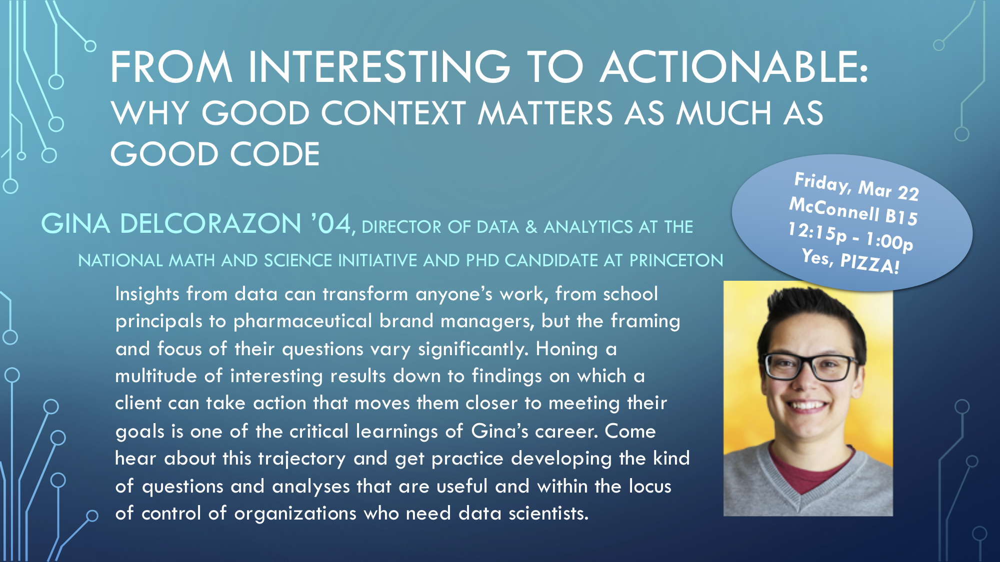{ width=650px }
<center> 

</br>


## Todays Topics/Activities  

### 1. Chalk Talk

<!--
summary table of regression models
Handout of terminology & definitions
-->

### 2. In-class exercise

* moderndive readings in above schedule.


***


# Lec 21: Wed 3/20

## Announcements

* No office hours today. I do however have appointments to book on Friday (see syllabus for link).
* Project proposal feedback given today. On Friday I will post information about the next phase "Project (initial) submission" due Fri 4/5 5pm.


## Todays Topics/Activities  

### 1. Chalk Talk

* Overall comments about project proposal.
* Recap of Lec20: Simulation. Goal is to study the effect of sampling variation.
* Sampling terminology, notation, and statistical definitions. Mastering these will take practice, practice, practice.


### 2. In-class exercise

* moderndive readings in above schedule.


### 3. Tweet of the day

Relating to the formating of your reports and in particular it's length. Do not include "superfluous" output as it only increases the "ink to information ratio." 

<blockquote class="twitter-tweet" data-lang="en"><p lang="en" dir="ltr">And be mindful of the work you leave for others</p>&mdash; Judge John Hodgman is supported by #maxfundrive (@hodgman) <a href="https://twitter.com/hodgman/status/758857741532221443?ref_src=twsrc%5Etfw">July 29, 2016</a></blockquote>
<script async src="https://platform.twitter.com/widgets.js" charset="utf-8"></script>


***


# Lec 20: Mon 3/18

## Announcements

* Over spring break moderndive Chapters 6 & 7 on basic and multiple regression went through a thorough renovation, so the presentation might be a little different. Please let me know if you have comments, questions, or feedback.
* Two events coming up:
    + Fri 3/22 12:15-1:00pm in McConnell B15: Gina DelCorazon '04, Director of Data & Analytics at The National Math and Science Initiative
    + Tue 3/26 12:15-1:05pm in Ford Hall Atrium: Presentation of SDS major

</br>

<center>
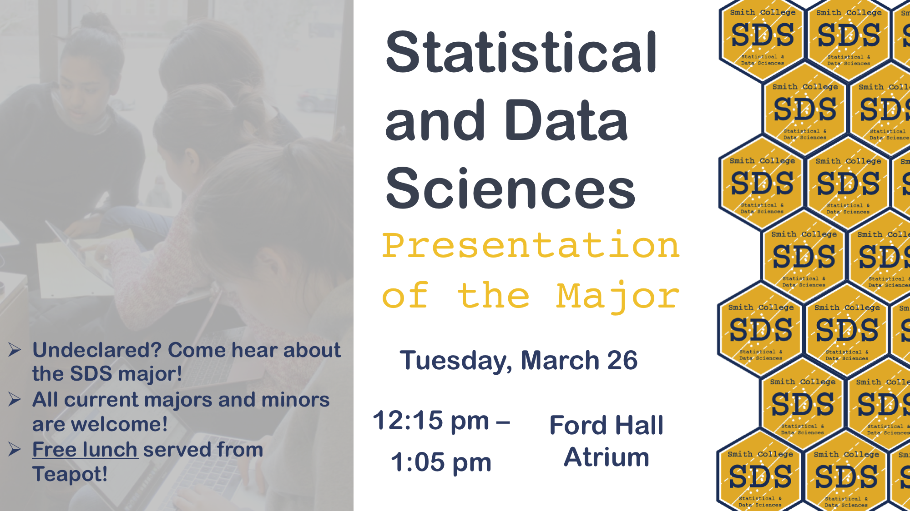{ width=650px }
<center> 

</br>


## Todays Topics/Activities  

### 1. Chalk Talk

**Sampling exercise**:

* Ask yourself "What proportion of this bowl's balls are red?"
* Come up to the front of the class and take a photo of the sample. **Do not delete this photo as you'll be submitting it later**
* Compute the proportion of the 50 balls that are red.
* Post a post-it on the histogram on the blackboard where the bins are *left-inclusive*. In other words, if you obtain a proportion of 0.2, put a post-it in the 0.2-0.25 bin. 


**Why are we doing this?**

* To study the effects of *sampling variation*
* Also, to update the contents of moderndive section 8.1.


### 2. In-class exercise

* moderndive readings in above schedule.


***


# Lec 19: Fri 3/8

## Announcements 

* Went over Midterm I


***


# Lec 18: Wed 3/6

## Announcements 

* Slack announcement + poll
* Guest lecturer today at 11:45am: Prof Randi Garcia. 
* Spinelli Center tutoring hours change tomorrow (Thursday 3/7) only: 4:30-6pm and not ~~7-9pm~~.
* Tweet of the day
* From New York Times article ["For Big-Data Scientists, ‘Janitor Work’ Is Key Hurdle to Insights"](https://www.nytimes.com/2014/08/18/technology/for-big-data-scientists-hurdle-to-insights-is-janitor-work.html){target="_blank"}:

> Yet far too much handcrafted work, what data scientists call "data wrangling," "data munging" and "data janitor work", is still required. Data scientists, according to interviews and expert estimates, **spend from 50 percent to 80 percent of their time** mired in this more mundane labor of collecting and preparing unruly digital data, before it can be explored for useful nuggets.

## Todays Topics/Activities       

### 1. Chalk talk

* Recap of Lec17
* More on designed experiments from OpenIntro Section 1.5 page 17 on Experiments; to access PDF of OpenIntro, click on "free online" link [here](https://www.openintro.org/stat/textbook.php?stat_book=isrs){target="_blank"}. **Blocking** in a randomized experiment:  
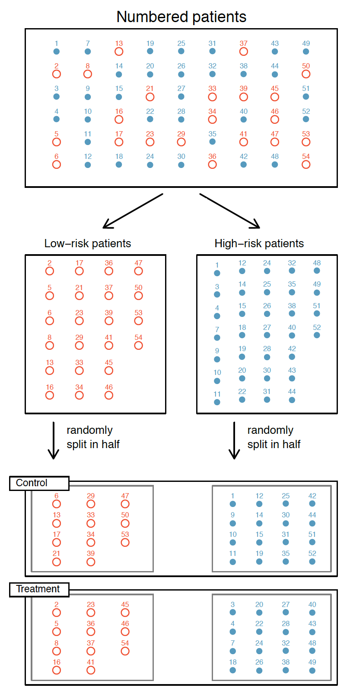{ width=300px }


### 2. Tweet of the day

Help Chester and me make this book as good as it can be before it goes to press! If something you read doesn't make sense, let me know!

<blockquote class="twitter-tweet" data-lang="en"><p lang="en" dir="ltr">Good news everyone! We’ve signed with <a href="https://twitter.com/CRCPress?ref_src=twsrc%5Etfw">@CRCPress</a> for a print edition with our new title: “Statistical Inference via Data Science: A moderndive into R &amp; the tidyverse” by <a href="https://twitter.com/old_man_chester?ref_src=twsrc%5Etfw">@old_man_chester</a> &amp; <a href="https://twitter.com/rudeboybert?ref_src=twsrc%5Etfw">@rudeboybert</a>! Coming Fall 2019! Until then check out a preview at <a href="https://t.co/X5zI0LvHGb">https://t.co/X5zI0LvHGb</a> <a href="https://t.co/Wa049JBeaJ">pic.twitter.com/Wa049JBeaJ</a></p>&mdash; ModernDive (@ModernDive) <a href="https://twitter.com/ModernDive/status/1102624954892406785?ref_src=twsrc%5Etfw">March 4, 2019</a></blockquote>
<script async src="https://platform.twitter.com/widgets.js" charset="utf-8"></script>


***


# Lec 17: Mon 3/4

## Announcements 

* Guest lecturer on Wed 3/6 at 11:45am: Prof Randi Garcia. 
* Reminder tomorrow is: 

<center>
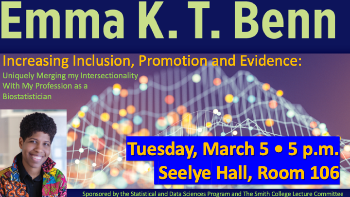{ width=650px }
<center>  

<br>

## Todays Topics/Activities       

### 1. Chalk talk

* Recap of Lec11: model selection
* Random assignment, causal inference, observational studies vs experiments.
* Example:
    + [Africa Quiz](https://docs.google.com/forms/d/e/1FAIpQLSeSQ1cZY0jGTpEzNCCcYu_gm1tTgH0wa6PYxJlJ-jcLi5JSHQ/viewform){target="_blank"}
    + [Africa Experiment](https://docs.google.com/forms/d/e/1FAIpQLSdW-D2PvqPrqyLwQ4En6mqMTeSK92f0y_wag84ipV9Fs0mjzQ/viewform){target="_blank"}
* Discussion questions:
    1. Why did I ask the question "Have you been to Africa before?"
    1. Why did I have the people with even-numbered birthdays take the "Africa Quiz" and those with odd-numbered birthdays take "Africa Experiment"?
    1. Comment on what you think the **difference** between the two histogram for heights will be for those who took the  "Africa Quiz" vs "Africa Experiment".


***


# Lec 16: Fri 3/1

## Announcements 

* Extra office hours on Friday 2:45-4pm.

## Todays Topics/Activities       

### 1. Chalk talk

* Question: How do we choose between interaction and parallel slopes models?
* Answer: In [`multiple_regression.html`](static/multiple_regression.html){target="_blank"} report. You can download the <a href="static/multiple_regression.Rmd" download>`multiple_regression.Rmd`</a> R Markdown file as well if you are curious. 

### 2. In-class exercise

* moderndive readings in above schedule.


***


# Lec 15: Wed 2/27

## Announcements 

* Clarifications of upcoming deadlines.
* Project proposal phase posted on [Term Projects](term_project.html#proposal) page.
* Extra office hours on Friday 2:45-4pm.


## Todays Topics/Activities       

### 1. Chalk talk

* 


### 2. In-class exercise

* 


***


# Lec 14: Mon 2/25

## Announcements 

* Midterm I details [posted](midterms.html#midtermI).
* Term project: I will
    + Give feedback on your "data proposals" on Slack by later today.
    + Post instructions for the next "Project proposal" phase by Wednesday; this phase is due Fri 3/8 5pm and involves data wrangling and exploratory data analysis. 

## Todays Topics/Activities       

### 1. Chalk talk

* Multiple regression

### 2. In-class exercise

* moderndive readings in above schedule.

### 3. Install development version of moderndive package

* **If you are working with RStudio Desktop, please follow these steps before tomorrow's lab. If you get stuck, please ask Jenny for help.**
* **If you are working on RStudio Server, you can ignore these steps.**

We're going to install the development AKA [beta-version](https://en.wiktionary.org/wiki/beta_version){target="_blank"} of the `moderndive` package, which includes a new function `gg_parallel_slopes()` allowing you to create a ggplot of the **parallel slopes model**.

1. Install the `devtools` package as you normally would install a package. Say yes to any prompts.
2. Run the following line in your console to install the development version of the `moderndive` package off of GitHub.com:  
`devtools::install_github("moderndive/moderndive", ref = "geom_parallel_slopes")`
3. Run `library(moderndive)` to reload the package.
3. Run `?gg_parallel_slopes` and see if the help file pops up. If it does, your installation worked!
4. Run example code at the bottom of the help file to see it in action! You should get the following plot:

<center>
{ width=600px }
</center>


***


# Lec 13: Fri 2/22

## Announcements 

* Seelye self-scheduled Midterm I next Fri 3/1 thru Sun 3/3; Midterm I review on Monday.

## Todays Topics/Activities       

### 1. Chalk talk

* Boxplots for EDA when explanatory variable $x$ is categorical.
* Indicator function
* What are fitted values and residuals when $x$ is categorical?

### 2. In-class exercise

* moderndive readings in above schedule.

### 3. Tweet of the day

Dr. Benn is excited for her talk at Smith College SDS! **Are you?**

<blockquote class="twitter-tweet" data-lang="en"><p lang="en" dir="ltr">Yessss!!! Definitely looking forward to speaking with and learning from the amazing <a href="https://twitter.com/SmithCollegeSDS?ref_src=twsrc%5Etfw">@SmithCollegeSDS</a> faculty and students! 🤗💃🏾🤗💃🏾 <a href="https://t.co/te01giEvXv">https://t.co/te01giEvXv</a></p>&mdash; Emma Benn (@EKTBenn) <a href="https://twitter.com/EKTBenn/status/1098396480719572993?ref_src=twsrc%5Etfw">February 21, 2019</a></blockquote>
<script async src="https://platform.twitter.com/widgets.js" charset="utf-8"></script>


***


# Lec 12: Wed 2/20

## Announcements 

* None

## Todays Topics/Activities       

### 1. Chalk talk

* Recap of Lec11: What do we mean by "best" fitting line? Note in the plot below there are 3 points marked with black dots along with:
    + The "best" fitting regression line in blue
    + An arbitrarily chosen line in dashed red
    + Another arbitrarily chosen line in dashed green 
```{r, eval=TRUE, echo=FALSE}
example <- tibble(
  x = c(0, 0.5, 1),
  y = c(2, 1, 3)
)
ggplot(example, aes(x = x, y = y)) +
  geom_smooth(method = "lm", se = FALSE, fullrange = TRUE) +
  geom_hline(yintercept = 2.5, col = "red", linetype = "dashed", size = 1) +
  geom_abline(intercept = 2, slope = -1, col = "forestgreen", linetype = "dashed", size = 1) +
  geom_point(size = 4)
# model_example <- lm(y ~ x, data = example)
# get_regression_table(model_example)
```
* Regression using a categorical explanatory variable  
```{r, eval = TRUE, echo = TRUE, results='asis'}
library(dplyr)
library(moderndive)

# Example data for chalk talk
example <- tibble(
  name = c("Bert", "Bert", "Bert", "Jenny", "Jenny", "Jenny", "Miles", "Miles", "Miles"),
  value = c(9, 10, 11, 11, 12, 13, 8, 9, 10)
)

# Get regression table
model_example <- lm(value ~ name, data = example)
get_regression_table(model_example)
```

### 2. In-class exercise

* Work on projects.
* moderndive readings in above schedule.


***


# Lec 11: Mon 2/18

## Announcements 

* Part of next lecture (Lec12 on Wed 2/20) will be devoted to work on project.
* Note in the above schedule that the topics for Lab06 and Lab07 have switched places, as originally it erroneously had you working on your project proposals **after** it was due. 

## Todays Topics/Activities       

### 1. Chalk talk

* Recap of Lec10
* What is a confounding variable?
* Fitted values & residuals via `get_regression_points()`
* What do we mean by "best" when we say that the regression line is the "best fitting" line?


### 2. In-class exercise

* moderndive readings in above schedule.


***


# Lec 10: Fri 2/15

## Announcements 

* [Project data](term_project.html#data) is due in a week!
* We'll devote part of Lec12 on Wed 2/20 to work on project data phase.


## Todays Topics/Activities       

### 1. Chalk talk

* Recap of Lec09
* Regression table via `get_regression_table()` and interpreting the regression line


### 2. In-class exercise

* moderndive readings in above schedule.


***


# Lec 9: Wed 2/13

## Announcements 

* Winner for best group name.

## Todays Topics/Activities       

### 1. Chalk talk

* Recap of Lec08
* Correlation coefficient

### 2. In-class exercise

* moderndive readings in above schedule.

### 3. Tweet of the day

Why are Jenny and Albert always on your cases about running `glimpse()` and `View()` on your data frames? **Looking at your data** is so deceptively simple that many people forget or ignore this step, even analysts/engineers with PhD's at Google! Before performing any kind of analysis, you must getting a sense of:

1. **What types of variables you have in your columns?** Numerical, categorical, text, dates?
1. **What values you have in your cells?** Units of any measurements?
1. **What is the quality of your data?** Do you have missing data? Are there crazy outliers?

These are the most fundamental steps to take before any data analysis! That's why moderndive starts in Chapter 2 with "Data exploration" with `glimpse()` and `View()`.

<blockquote class="twitter-tweet" data-lang="en"><p lang="en" dir="ltr">Shout-out to people like me who like taking a look at even huge tables of raw data before summarizing or transforming, to get a sense of what&#39;s in there and spot potential data quality issues. Step 1 in data exploration! <a href="https://t.co/wVLHWcVNWA">pic.twitter.com/wVLHWcVNWA</a></p>&mdash; Data Science Renee (@BecomingDataSci) <a href="https://twitter.com/BecomingDataSci/status/1095421569428529153?ref_src=twsrc%5Etfw">February 12, 2019</a></blockquote>
<script async src="https://platform.twitter.com/widgets.js" charset="utf-8"></script>


***


# Lec 8: Mon 2/11

## Announcements 

* Everybody join the `term_project` channel in Slack.
* Discuss [Data due](term_project.html#data) phase of term-project.

## Todays Topics/Activities       

### 1. Chalk talk

* Recap of Lec07:
    + What does `group_by()` by itself do?
    + Difference between `filter()` and `group_by() %>% summarize()`
* Last three verbs:
    + `mutate()` existing variables to create new ones
    + `arrange()` rows in ascending or `desc()`ending alphanumeric order of another variable
    + `select()` or drop variables

### 2. In-class exercise

moderndive readings in above schedule.


***


# Lec 7: Fri 2/8

## Announcements 

* Term project groups are due today at 5pm. Make sure your group leader has completed all three steps, in particular the Google Form.
* I will introduce next phase of term project on Monday: [Data due: Fri 2/22 5pm](term_project.html#data).

## Todays Topics/Activities       

### 1. Chalk talk

* Recap of Lec06
* Computing summary statistics using `summarize()`
* Adding `Groups` *meta-data* using `group_by()`. See example code below.
* Computing summary statistics split by group using `group_by() %>% summarize()` 


### 2. In-class exercise

moderndive readings in above schedule.


***


# Lec 6: Wed 2/6

## Announcements 

* Reminder that ["Multiple Imputation Methods in Cluster Randomzied Trials"](static/events/bailey.png){target="_blank"} by Prof. Brittney Bailey from Amherst College is tomorrow 12:10pm in McConnell B15!
* [DataFest](http://www.science.smith.edu/datafest/){target="_blank"} is a weekend-long "data science hackathon" for teams of up to 5 students and is at UMass the weekend of March 29-31! [Info session](static/events/datafest2019.pdf){target="_blank"} by Prof. Randi Garcia today 7-8pm in Sabin-Reed 301 (here)!


## Todays Topics/Activities       

### 1. Chalk talk

* Recap of Lec05.
* Say I want visualize the distribution of temperature split by month. Two options
    + Faceted histogram [Figure 3.16](https://moderndive.netlify.com/3-viz.html#facets){target="_blank"}
    + Boxplot [Figure 3.23](https://moderndive.netlify.com/3-viz.html#geomboxplot){target="_blank"}
* Starting Data Wrangling: the pipe operator `%>%` and `filter()` rows of a data frame.

### 2. In-class exercise

moderndive readings in above schedule.


***


# Lec 5: Mon 2/4

## Announcements 

* Added note to syllabus on office hours: *If you're having R or RStudio issues, please have your computer and RStudio loaded and ready to go.*
* ModernDive Chapters 4 & 5 are now reordered and renamed:
    + Chapter 4: ~~Tidy Data via tidyr~~ Data Wrangling
    + Chapter 5: ~~Data Wrangling via dplyr~~ Data Importing and "Tidy" Data
* Term project groups are due this Friday 5pm; see [Term Project](term_project.html). If you need a group, Slack me.
* Lab tomorrow: Jenny will talk about DataCamp & cover data visualization.

## Todays Topics/Activities       

### 1. Chalk talk

```{r, echo=FALSE, eval=TRUE}
library(ggplot2)
library(dplyr)
example <- tibble(
  values = c(1, 3, 5, 6, 7, 8, 9, 12, 13, 14, 15, 30)
)
```

* Recap of Lec04: Histogram binning structure & facets
* Boxplot to show the *distribution* of a numerical variable split by a categorical variable. Say we want to plot a boxplot of the following `r nrow(example)` values which are pre-sorted: 

> `r example %>% pull(values)`

They have the following *summary statistics*:


Min. | 1st Qu. | Median  | 3rd Qu.  |  Max. 
---- | ------- | ------  |  ------- | --- 
`r min(example$values)`  |  `r quantile(example$values, probs=0.25, type = 2)` |  `r median(example$values)`  |  `r quantile(example$values, probs=0.75, type=2)`  | `r max(example$values)`

<!--Let's compare the points and the corresponding boxplot side-by-side with the values on the $y$-axis matching:-->

```{r, echo=FALSE, eval=TRUE, cache=TRUE}
plot1 <- ggplot(example, aes(x=factor(1), y=values)) +
  geom_point() +
  labs(title = "Points") +
  theme(
    axis.title.x = element_blank(),
    axis.text.x = element_blank(),
    axis.ticks.x = element_blank()
  )

plot2 <- ggplot(example, aes(x=factor(1), y=values)) +
  geom_boxplot() +
  labs(title = "Boxplot") +
  theme(
    axis.title.x = element_blank(),
    axis.text.x = element_blank(),
    axis.ticks.x = element_blank()
  )
plot1 + plot2
```

### 2. In-class exercise

* R Markdown:
    + Don't be afraid of error messages! In particular the line number where the error occurs!
    + Heads up! `View()` nor `?` will prevent your `.Rmd` files from knitting (i.e. the HTML report won't get created)!
* moderndive readings in above schedule.


***


# Lec 4: Fri 2/1

## Announcements 

* Slack message and `#moderndive_typoes`
* Remember the `Warning: Removed 5 rows containing missing values (geom_point).` warning message you got when creating a scatterplot of `alaska_flights` arrival and departure delays? Check out this talk by Prof. Brittney Bailey from Amherst College next Thursday 2/7 12:10pm in McConnell B15:

<center>
{ width=700px }
</center>

## Todays Topics/Activities       

### 1. Chalk talk

* Recap of Lec03.
* Histograms to show *distribution* of a numerical variable.

### 2. In-class exercise

* Live demo: Some tips on workflow for in-class exercises.
    + "Typing/running code directly in console" vs "typing code in your `class_notes.Rmd` R Markdown file and *sending* it to the console to run."
    + Quickly switching applications on your computer with "command + tab" (macOS) or "control + tab" (Windows)
    + Making code human-friendly to read! Be empathetic to your collobators by writing nice code, in particular your most [important collaborator](https://rmhogervorst.nl/cleancode/blog/2016/05/26/content/post/2016-05-26-your-most-valuable-collaborator-future-you/){target="_blank"}!
    + For example: hard returns between code chunks.
    + See screencast of live demo below!
* **Please close your RStudio Server window when not working! It uses up Smith server resources if you don't!**
* ModernDive readings for Lec04 in above schedule.

<iframe width="560" height="315" src="https://www.youtube.com/embed/OCBJxThDUno" frameborder="0" allow="accelerometer; autoplay; encrypted-media; gyroscope; picture-in-picture" allowfullscreen></iframe>

### 3. Tweet of the day

The BBC uses `ggplot2` for data journalism!

<blockquote class="twitter-tweet" data-lang="en"><p lang="en" dir="ltr">The BBC releases its ggplot toolkit, bbplot! <a href="https://t.co/TMLI2kTMJn">https://t.co/TMLI2kTMJn</a></p>&mdash; Kieran Healy (@kjhealy) <a href="https://twitter.com/kjhealy/status/1091304909528580097?ref_src=twsrc%5Etfw">February 1, 2019</a></blockquote>
<script async src="https://platform.twitter.com/widgets.js" charset="utf-8"></script>


***


# Lec 3: Wed 1/30

## Announcements 

* Slack message and `#moderndive` typos
* Updated [Term Project](term_project.html) page with:
    + Information on first phase: Form groups
    + Example of final "resubmission" due the last day of class. Note this example is subject to change throughout the semester.
* Added all Term Project items to Moodle.


## Todays Topics/Activities       

### 1. Chalk talk

* Recap of Lec02: `nycflights13` package and `glimpse()`/`View()` functions.
* What is a *function*? What are *arguments*?
* Grammar of graphics
* Scatterplots

### 2. In-class exercise

ModernDive readings for Lec03 in above schedule. Now that you've seen R Markdown in Lab 1:

* Create a `.Rmd` file and save it as `class_notes.Rmd`. That way you can save all your code for re-use later, like a Word document.
* Copy and paste any code from ModernDive into "code chunks" in `class_notes.Rmd`. That way you can easily tweak/modify code.
* "Run" code in the console from the "code chunks" in `class_notes.Rmd` as you learned in Lab 1.
* Again, you do not need to submit any answers for learnings checks, however **you are resposible for completing the readings, running all code, and doing all learning checks doing before the next lecture**.


***


# Lec 2: Mon 1/28

## Announcements 

* On [Moodle](https://moodle.smith.edu/course/view.php?id=33093){target="_blank"}
    + If you haven't already, please complete all the steps in "start here"
    + If you are trying to register for this course, see the posted registration priority list.
* Outside help:
    + Spinelli Center for Quantitative Learning [tutoring](https://www.smith.edu/qlc/tutoring.html?colStats=open#PanelStats){target="_blank"} hours (Sunday-Thursday 7-9pm in Sabin-Reed 301) start tonight.
    + My office hours are now posted on [syllabus](syllabus.html).
* Slack
    + Did you get a Slack notification in some form for my message on Saturday at 9AM: mobile/desktop or email notification? You are responsible for staying on top of in-between lecture notifications.
    + First student question posted on `#questions` Slack channel`r set.seed(79);emo::ji("hooray")` !!!  The `r set.seed(79);emo::ji("trophy")` for first student answer to a student question is still up for grabs!
* First lab with Dr. Jenny Smetzer is tomorrow. Problem set 01 (PS01) will be posted on Moodle. ~~the Problem Sets page~~.

## Todays Topics/Activities       

### 1. Chalk Talk

Why chalk talks? Read the [Field Notes](https://twitter.com/FieldNotesBrand){target="_blank"} slogan.

### 2. In-class exercise

Why undirected in-class exercise time? People all learn at their own pace. What to do:

1. Open RStudio (R in the menu bar above)
1. Open ModernDive (ModernDive in menu bar above)
1. As indicated in the above schedule, read ModernDive Chapter 2 while running all code in the *console*.
1. You can skip all videos and the DataCamp links as we'll be talking about those in class.
1. You do not need to turn in Learning Checks, those are for your practice. The solutions are in Appendix D.
1. If you have questions, ask a peer. If you're still stuck, ask me!

Recall from the "How can I succeed in this class?" discussion in the [syllabus](syllabus.html):

> * **Lectures, labs, and readings:**
>     + *"Am I actually running the code and studying the outputs in R during in-class exercises, or am I just skimming the text?"*
>     + *"Am I completing all the ModernDive readings/in-class activites for a given lecture before the start of the next lecture?"*
>     + *"During in-class exercises and lab time, am I taking full advantage that I'm in the same place at the same time with the instructor, the lab assistants, and most importantly your peers, or am I browsing the web/texting the whole time?"*
> * **Problem sets, DataCamp, and coding:**
>     + *"When learning to code, much like learning a language, have I been really pushing myself to practice, practice, practice?"*


***


# Lec 1: Fri 1/24

## Announcements

* Please ensure you have followed all the "start here" instructions posted on [Moodle](https://moodle.smith.edu/course/view.php?id=33093){target="_blank"}. Please remember that **just because you can access the moodle page does not guarantee you are registered for the course**. I will post a "priority list" of waitlisted students on Moodle by tomorrow.
* What is the difference between SDS/MTH 220 vs SDS 201?
* Who is rudeboybert?
* Website features
* Slack demo
* Final project discussion
* Food for thought on coding:

<blockquote class="twitter-tweet" data-lang="en"><p lang="en" dir="ltr">New blog post!<br><br>👩🏻
💻👨🏿
💻👩🏾
💻👨🏽
💻👩🏼
💻👩🏿
💻👨🏻
💻<br><br>Why women in psychology can&#39;t program<br><br>&quot;About two months ago my brother, who works in a data science on social psychology data, asked me why his colleagues, who are women and have PhDs in psychology, cannot code&quot;<a href="https://t.co/5ZYx28sWr1">https://t.co/5ZYx28sWr1</a></p>&mdash; Olivia Guest | Ολίβια Γκεστ (@o_guest) <a href="https://twitter.com/o_guest/status/1067079340507217920?ref_src=twsrc%5Etfw">November 26, 2018</a></blockquote>
<script async src="https://platform.twitter.com/widgets.js" charset="utf-8"></script>


***


<!--

# Lec 36: Mon 12/10 {#Lec36}

## Announcements

* Extra office hours reading/exam week:
    + Jenny: Drop-in on Tue 12/18 between 9:40am-11:40am and between 1:20pm-4:00pm. Please be organized! Don't have two team members drop in to ask the same thing twice!
    + Albert:
        + Mon 12/17 12pm-2:30pm
        + Tue 12/18 1:30-3:30pm
        + ~~Wed 12/19 1pm-3pm~~
        + Fri 12/21 11am-1pm
* Added two notes on 12/10 about term project [resubmission](term_project.html#resubmission) instructions.
* Quiz during lecture on Wednesday as well as time for project work.


***


# Lec 35: Fri 12/7 {#Lec35}

## Announcements

* **Favor to ask**: Help out RStudio's efforts to make data science accessible to more individuals and more demographic groups by filling out this 5 minute survey on how you learn R!

<blockquote class="twitter-tweet" data-lang="en"><p lang="en" dir="ltr">Please take our 5 minute survey so we (<a href="https://twitter.com/rstudio?ref_src=twsrc%5Etfw">@rstudio</a>) can learn more about how people learn <a href="https://twitter.com/hashtag/rstats?src=hash&amp;ref_src=twsrc%5Etfw">#rstats</a>: <a href="https://t.co/KUH0NPnK3x">https://t.co/KUH0NPnK3x</a>. Findings will be presented at rstudio::conf 2019 (and online)</p>&mdash; Hadley Wickham (@hadleywickham) <a href="https://twitter.com/hadleywickham/status/1070726165764194304?ref_src=twsrc%5Etfw">December 6, 2018</a></blockquote>
<script async src="https://platform.twitter.com/widgets.js" charset="utf-8"></script>   


## Today's Topics/Activities

### 1. Chalk Talk


### 2. In-class exercise


***


# Lec 34: Wed 12/5 {#Lec34}

## Announcements

None

## Today's Topics/Activities

### 1. Chalk Talk

* Finishing confidence intervals
* Started hypothesis testing, in particular the idea of "permutations"

<iframe width="560" height="315" src="https://www.youtube.com/embed/2pHhjx9hyM4" frameborder="0" allow="accelerometer; autoplay; encrypted-media; gyroscope; picture-in-picture" allowfullscreen></iframe>

<br>

### 2. In-class exercise

Based on this code:

<script src="https://gist.github.com/rudeboybert/b5dde565a50df08571dabb6ec53ab58e.js"></script>


***


# Lec 33: Mon 12/3 {#Lec33}

## Announcements

* Office hours: Today ~~3-6pm~~ 3-4:45pm, tomorrow: 3-6pm.


## Today's Topics/Activities

### 1. Chalk Talk

* Confidence interval terminology
* Interpreting confidence intervals

### 2. In-class exercise

Read ModernDive 9.5-9.6

### 3. Tweet of the day

Statistical inference as a `%>%` chain of verbs! Click the tweet to see a GIF:

<blockquote class="twitter-tweet" data-lang="en"><p lang="en" dir="ltr">ICYMI, dig this visual intro to the infer 📦 verbs…<br>🌲 &quot;Statistical Inference: A Tidy Approach&quot; by <a href="https://twitter.com/old_man_chester?ref_src=twsrc%5Etfw">@old_man_chester</a> <a href="https://t.co/vEtDotrWcf">https://t.co/vEtDotrWcf</a> <a href="https://twitter.com/hashtag/rstats?src=hash&amp;ref_src=twsrc%5Etfw">#rstats</a> ht <a href="https://twitter.com/LVaudor?ref_src=twsrc%5Etfw">@LVaudor</a> <a href="https://t.co/4JJHSclz2i">pic.twitter.com/4JJHSclz2i</a></p>&mdash; Mara Averick (@dataandme) <a href="https://twitter.com/dataandme/status/1069290620274073600?ref_src=twsrc%5Etfw">December 2, 2018</a></blockquote>
<script async src="https://platform.twitter.com/widgets.js" charset="utf-8"></script>


***


# Lec 32: Fri 11/30 {#Lec32}

## Announcements

* Midterm starts at 6pm
* What is the [`tidyverse`](https://www.tidyverse.org/packages/){target="_blank"}?

<center>
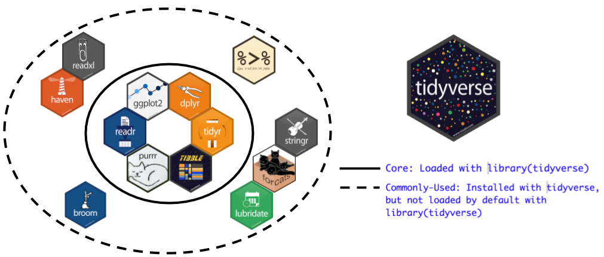
</center>
<br>

## Today's Topics/Activities

### 1. Chalk Talk

Based on the following code; copy this into a scratchpad. Make sure you have the `tidyverse` package installed.

<script src="https://gist.github.com/rudeboybert/4b3591ac7f4e81b73cd61b042cf1d37a.js"></script>

### 2. In-class exercise

Read ModernDive 9.2-9.4


***


# Lec 31: Wed 11/28 {#Lec31}

## Announcements

* Initial project submission feedback session: Book a session for next week on [youcanbookme](https://rudeboybert.youcanbook.me/service/jsps/cal.jsp?cal=4e3d341c-d9d3-480f-b0ca-2dbc2dc4ec56&ini=1543416671567&jumpDate=2018-12-03){target="_blank"} where if possible all group members can attend.
* Instructions for resubmission due Fri 12/21 5pm now posted on [Term Project](term_project.html) page.


## Today's Topics/Activities

### 1. Chalk Talk

* Go over practice Midterm III
* Introduced `infer` thinking.

### 2. Tweet of the day

`infer` package makes statistical inference tidy and transparent!

<blockquote class="twitter-tweet" data-lang="en"><p lang="en" dir="ltr"><a href="https://twitter.com/Reed_College_?ref_src=twsrc%5Etfw">@Reed_College_</a>&#39;s Andrew Bray on the {infer} <a href="https://twitter.com/hashtag/rstats?src=hash&amp;ref_src=twsrc%5Etfw">#rstats</a> package to make statistical inference tidy &amp; transparent <a href="https://t.co/bCfK7Wnn0M">https://t.co/bCfK7Wnn0M</a> <a href="https://twitter.com/hashtag/JSM2018?src=hash&amp;ref_src=twsrc%5Etfw">#JSM2018</a> <a href="https://t.co/VGOyeHaIVU">pic.twitter.com/VGOyeHaIVU</a></p>&mdash; Albert Y. Kim (@rudeboybert) <a href="https://twitter.com/rudeboybert/status/1024054836277342208?ref_src=twsrc%5Etfw">July 30, 2018</a></blockquote>
<script async src="https://platform.twitter.com/widgets.js" charset="utf-8"></script>


***


# Lec 30: Mon 11/19 {#Lec30}

## Announcements

* Lecture today starts at 1:20pm
* Midterm III details posted; we'll go over practice midterm on Wednesday after the break.
* Upcoming schedule.
    + Today and tomorrow: No office hours
    + Mon 11/26: No lecture and no office hours
    + Tue 11/27: Regular office hours 3-6pm
    + I am out of town from this afternoon Mon 11/19 until the morning of Tue 11/27 and won't be on Slack.
    + Project feedback after break


## Today's Topics/Activities

### 1. Chalk Talk

Now swithing from tactile to virtual resampling using `infer` package!

<center>
{ width=200px }
</center>


***


# Lec 29: Fri 11/16 {#Lec29}

## Announcements

* Upcoming schedule:
    + Mon 11/19: Midterm III review.
    + Mon 11/26 (after break): No lecture
    
## Today's Topics/Activities

### 1. Chalk Talk

* Connecting sampling distributions and "Hang the DJ" episode
* Analyzing the tactile "resampling **with** replacement" simulation from Lec28 based on a **single** sample of size $n=10$

<center>
{ width=200px }
</center>

<br>

```{r, echo=FALSE, eval=TRUE}
data <- data_frame(
  resample_mean = c(63, 65.1, 63.9, 63.2, 64, 65.4, 63.3,
                    63.2, 64.2, 64.2, 63.7, 64.4, 63.3, 64.4,
                    64, 63.9, 62.9, 64.7, 63.7)
)

ggplot(data, aes(x = resample_mean)) +
  geom_histogram(binwidth = 2) +
  labs(x = "Resample mean height (inches)", title = "Bootstrap distribution based on 19 resamples from original sample of n=10")
```


### 2. In-class exercise

* ModernDive 9.1
* Install `infer` package
* Do PS10


### 3. Tweet of the day

From this past Monday Nov 12:

<blockquote class="twitter-tweet" data-lang="en"><p lang="en" dir="ltr">Huge congratulations to Professor Brad Efron, who wins the statistical equivalent of the Nobel Prize for creating the &#39;bootstrap&#39; method, the &#39;best statistical pain reliever ever produced&#39; <a href="https://t.co/tHAHS09Cqv">https://t.co/tHAHS09Cqv</a> <a href="https://t.co/Qei54av5sN">https://t.co/Qei54av5sN</a></p>&mdash; Royal Statistical Society (@RoyalStatSoc) <a href="https://twitter.com/RoyalStatSoc/status/1061918061794676736?ref_src=twsrc%5Etfw">November 12, 2018</a></blockquote>
<script async src="https://platform.twitter.com/widgets.js" charset="utf-8"></script>


***


# Lec 28: Wed 11/14 {#Lec28}

## Announcements

* Quiz today
    
## Today's Topics/Activities

### 1. Chalk Talk

Handout: Recap of ModernDive Figure 8.14 below

<center>
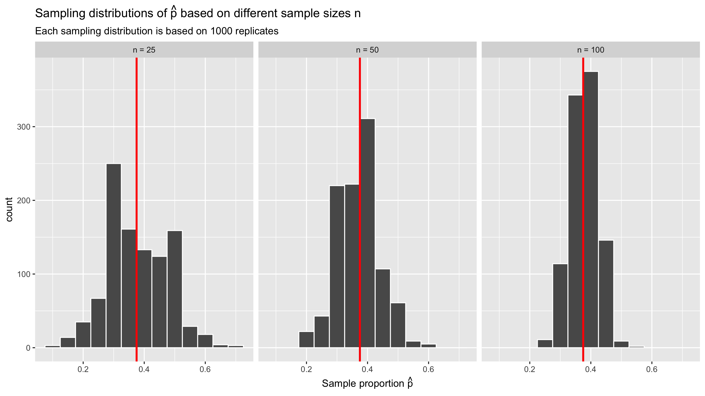{ width=800px }
</center>

### 2. In-class exercise

Bootstrap tactile resampling simulation based on slips of paper with your
name/height written on them. Recall we took a sample of size $n=10$ students.


***


# Lec 27: Mon 11/12 {#Lec27}

## Announcements

* Term project: No more poster presentations at the end of semester. 

    
## Today's Topics/Activities

### 1. Chalk Talk

* "Virtual sampling simulation" (by computer)
* In real-life sampling: polls

### 2. In-class exercise

Read ModernDive 8.3 on "Virtual sampling simulation" and 8.4 with an example on polls.


***


# Lec 26: Fri 11/9 {#Lec26}

## Announcements

* **Are you?**
    + Interested in how to use statistical methods to make causal conclusions about observational data? In other words, when you data was NOT collected through a randomized experiement like a clinical trial or an A/B-test? `r emo::ji("100")`  
    + Interested in public health and/or HIV/AIDS?`r emo::ji("100")`  
    + Interested in finding out how you can use social networks to influence behavior?`r emo::ji("100")`  
    + Interested in ways to improve health of high risk populations such as people who inject drugs?`r emo::ji("100")`  
* **Then come to this talk:**

<center>
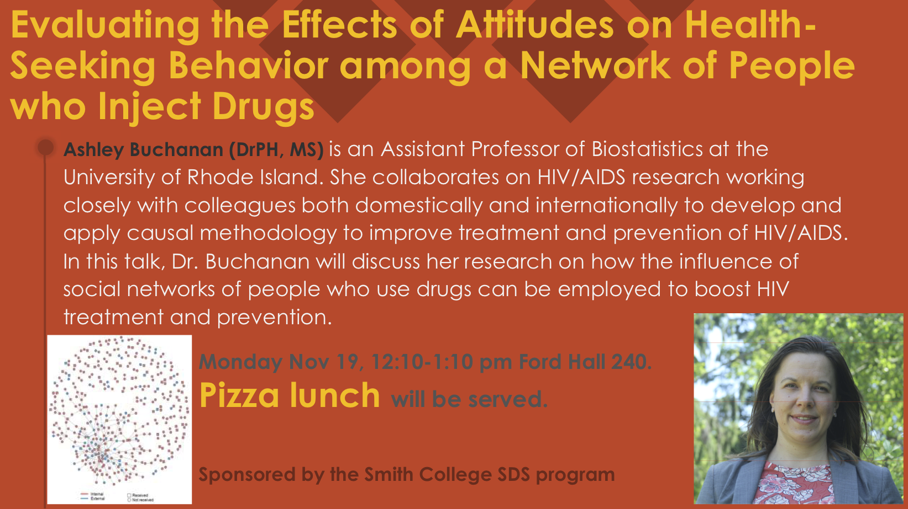{ width=600px }
</center>
<br>

## Today's Topics/Activities

### 1. Chalk Talk

* Discuss tweet of the day
* Normal distribution theory
* "Tactile sampling simulation" (by hand)

### 2. In-class exercise

Read ModernDive 8.1 & 8.2 on sampling terminology and "Tactile sampling simulation"

### 3. Tweet of the day

Question: Does living near a Whole Foods **cause** increases in the likelihood of voting Democrat?

<blockquote class="twitter-tweet" data-lang="en"><p lang="en" dir="ltr">So first, the basics. There are 470 WF across the U.S., and 233/435 CD&#39;s have at least 1 WF in them. WF districts did tend to prefer Clinton over Trump, as they had an average 2016 pres. margin of +13 Clinton, while non-WF districts preferred Donald Trump by +8 points. (2/9) <a href="https://t.co/Kv11asuuAc">pic.twitter.com/Kv11asuuAc</a></p>&mdash; Grant Gregory (@GrantrGregory) <a href="https://twitter.com/GrantrGregory/status/1054044413104660485?ref_src=twsrc%5Etfw">October 21, 2018</a></blockquote>
<script async src="https://platform.twitter.com/widgets.js" charset="utf-8"></script>


***


# Lec 25: Wed 11/7 {#Lec25}

## Today's Topics/Activities

* Added [tips](term_project.html#initialtips) to consider for initial submission
* Class time to work on projects


***


# Lec 24: Mon 11/5 {#Lec24}

## Today's Topics/Activities

### 1. Sampling Exercise

<center>
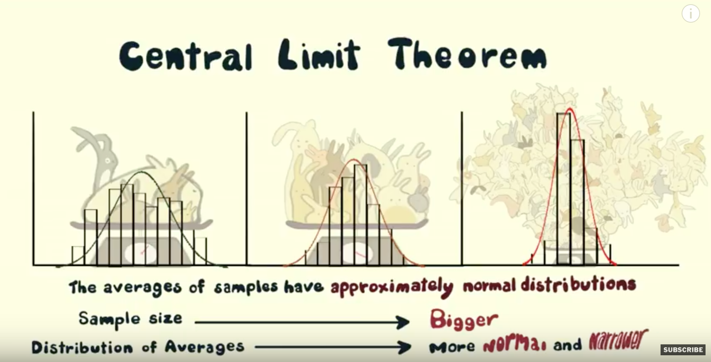{ width=800px }
</center>


***


# Lec 23: Fri 11/2 {#Lec23}

## Announcements

* Updated Midterm II instructions:
    + Bring a calculator! Scientific calculators ok, mobile phones not. 
    + Cover page posted.
* Project proposal feedback delivered. Many groups had a very right-skewed explanatory and/or outcome variable. In those cases, do a `log10()`-transformation as seen in the "Modeling with data in the tidyverse" course where we `mutate()` new `log10_price` and `log10_size` variables.


## Today's Topics/Activities

### 1. Chalk Talk

Observational studies vs randomized experiments. In particular recall from PS04:

```{r, echo=FALSE, eval=TRUE}
africa_results <- read_csv("https://rudeboybert.github.io/SDS220/static/PS/africa_results.csv") 
africa_results
ggplot(africa_results, aes(x = priming_number, y = how_many_countries)) +
  geom_boxplot() +
  labs(x = "Priming number", y = "Number of countries in Africa guessed",
       title = "Effects of priming number of number of countries guessed in Africa")
```

### 2. Tweet of the day

<blockquote class="twitter-tweet" data-lang="en"><p lang="en" dir="ltr">Excited about Berkeley’s new Division of Data Science and Information - with 1000 majors already! <a href="https://t.co/31WTxPD43l">https://t.co/31WTxPD43l</a></p>&mdash; Deborah Nolan (@DebAtStat) <a href="https://twitter.com/DebAtStat/status/1058037503037452289?ref_src=twsrc%5Etfw">November 1, 2018</a></blockquote>
<script async src="https://platform.twitter.com/widgets.js" charset="utf-8"></script>


***


# Lec 22: `r emo::ji("halloween")`Wed 10/31`r emo::ji("halloween")` {#Lec22}

## Announcements

* No lab Tuesday 11/20.
* Go over practice midterm questions

## Today's Topics/Activities

### 1. Chalk Talk

Causal Inference

### 2. In-class exercise

* Look at [Spurious Correlations](http://www.tylervigen.com/spurious-correlations){target="_blank"}
* Read ModernDive 6.3.2


### 3. Install development version of moderndive package

We're going to install the development AKA [beta-version](https://en.wiktionary.org/wiki/beta_version){target="_blank"} of the `moderndive` package, which as of this morning includes a new function `gg_parallel_slopes()` allowing you to create a ggplot of the **parallel slopes model**. Note, this function is an inelegant hack but it gets the job done (source code on [GitHub](https://github.com/moderndive/moderndive/blob/geom_parallel_slopes/R/ggplot_parallel_slopes.R){target="_blank"}).

1. Install the `devtools` package as you normally would install a package. Say yes to any prompts.
2. Run the following line in your console to install the development version of the `moderndive` package off of GitHub.com, specifically the `geom_parallel_slopes` branch:  
`devtools::install_github("moderndive/moderndive", ref = "geom_parallel_slopes")`
3. Run `library(moderndive)` to reload the package.
3. Run `?gg_parallel_slopes` and see if the help file pops up. If it does, your installation worked!
4. Run example code at the bottom of the help file to see it in action! You should get the following plot:

<center>
{ width=600px }
</center>


***


# Lec 21: Mon 10/29 {#Lec21}

## Announcements

* **Joint SDS/Government faculty hiring**: First candidate is coming to campus tomorrow (Tuesday 10/30)! They will be holding a "mock lecture" at 5pm in Sabin-Reed 301 where they will teach a lecture on an intermediate/advanced topic in an way that is accessible to undergrads.
* Office hours tomorrow: ~~3-6pm~~ 3-5pm.
* Midterm II [topics](midterms.html#midtermII).
* Project proposal feedback over Slack tomorrow!

## Today's Topics/Activities

### 1. Chalk Talk

* **Recall**: There are two possible models for regression with one categorical and one numerical $x$ explanatory variable:
    + Parallel slopes model: easy to interpret, hard to make a `ggplot` of.
    + Interaction model: harder to interpret, easy to make a `ggplot` of.
* **Last Friday**: Parallel slopes model
* **Today**: Interaction model

### 2. In-class exercise

Read ModernDive Chapter 7.2.3 - 7.2.5. 


***


# Lec 20: Fri 10/26 {#Lec20}

## Announcements

* From [Smithies in SDS](https://www.facebook.com/SmithiesInSDS/){target="_blank"}. Entirely student-run data science day! Saturday, November 3rd 10am-2pm! **RSVP through the Smith Social Network [here](https://socialnetwork.smith.edu/event/2876976){target="_blank"}!**

<center>
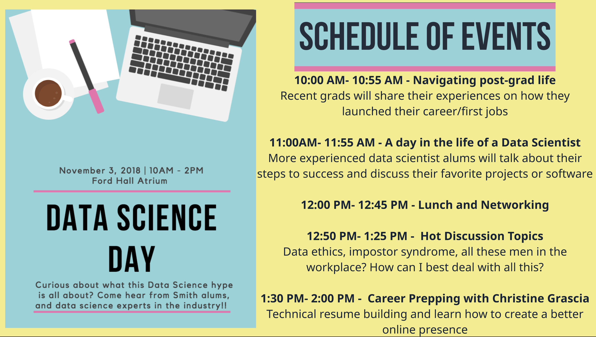{ width=600px }
</center>
<br>

## Today's Topics/Activities

### 1. Chalk Talk

* Last topic needed for term project initial submission.
* Two possible models for regression with one categorical and one numerical $x$ explanatory variable:
    + Parallel slopes model: easy to interpret, hard to make a `ggplot` of.
    + Interaction model: harder to interpret, easy to make a `ggplot` of.
* Today: parallel slopes model!

### 2. In-class exercise

Read ModernDive Chapter 7.2.1 & 7.2.2. 

### 3. Tweet of the day

In order for me to be able to recreate/reproduce/replicate your work, I need:

1. Access to your data! If you only submitted a `project_proposal.R` file but not the `.csv`/`.xlsx` data file, I can't recreate/reproduce/replicate your graphs! 
1. If the code that loads your `.csv`/`.xlsx` data file looks something like  
`read_csv("~/Desktop/My Smith Work/2018-19/Term Project/my_data.csv")`  
When I run this code it won't load the data since the `my_data.csv` file will not be in the same folder **on my computer**.

**Suggested approach**: Instead of submitting `.csv`/`.xlsx` data files on Moodle, publish your data to the web and load into R from there!

1. Click on tweet below to see all steps
1. Publish your data to the web (only if it is non-sensitive nor non-private)
1. Update your project proposal with the `read_csv("WEBLINK TO YOUR DATA")` code that loads the data and test all your code to ensure it all runs.
1. **Group leader only**: Resubmit your `project_proposal.R` file in a Slack group DM that has me and all your group members by Saturday 10/27 at 5pm. 

<blockquote class="twitter-tweet" data-lang="en"><p lang="en" dir="ltr">Hey data science ed types! If you don&#39;t want to deal w/ teaching relative vs absolute file paths when loading CSV&#39;s into <a href="https://twitter.com/hashtag/rstats?src=hash&amp;ref_src=twsrc%5Etfw">#rstats</a> at first (I favor punting until later), have your students publish their (non-sensitive data) CSV&#39;s to Google Sheets!</p>&mdash; Albert Y. Kim (@rudeboybert) <a href="https://twitter.com/rudeboybert/status/1055821833512071168?ref_src=twsrc%5Etfw">October 26, 2018</a></blockquote>
<script async src="https://platform.twitter.com/widgets.js" charset="utf-8"></script>


***


# Lec 19: Wed 10/24 {#Lec19}

## Announcements

* `r emo::ji("fire")`**SDS Major Flowchart** `r emo::ji("fire")`: All courses highlighted in red in the flowchart below will be offered in Spring 2019, along with the following core 5 courses (left-most grey block in flowchart):
    1. SDS 201/220: Intro Stats
    1. SDS/MTH 291: Multiple Regression
    1. CSC 111: Intro Programming (in Python)
    1. SDS 192: Intro to Data Science
    1. MTH 211: Linear Algebra
* **Course descriptions**: Check out Smith Course Search for [SDS courses](https://www.smith.edu/academics/academic-program/curriculum/course-search?term=Spring+2019&dept=Statistical+and+Data+Sciences&instr=&credits=&course_numb=&course_keywd=&op=Submit&form_build_id=form-FjEA1i8POuiCUrY4KeFdU3um3UTFlX78jICWJ25ggGU&form_id=campus_course_search_basic_search_form){target="_blank"}, [CSC courses](https://www.smith.edu/academics/academic-program/curriculum/course-search?term=Spring+2019&dept=Computer+Science&instr=&credits=&course_numb=&course_keywd=&op=Submit&form_build_id=form-wroGqwD8PoEpDGC6bbuWoTDEXmsGKhg_QI-YQHuT_Ug&form_id=campus_course_search_basic_search_form){target="_blank"}, and [MTH courses](https://www.smith.edu/academics/academic-program/curriculum/course-search?term=Spring+2019&dept=Mathematics+%26+Statistics&instr=&credits=&course_numb=&course_keywd=&op=Submit&form_build_id=form-LetzAvSraLo4Xpnsuc0eCv32W_Y_V4Uadf0oauMwViU&form_id=campus_course_search_basic_search_form){target="_blank"}.
    

<center>
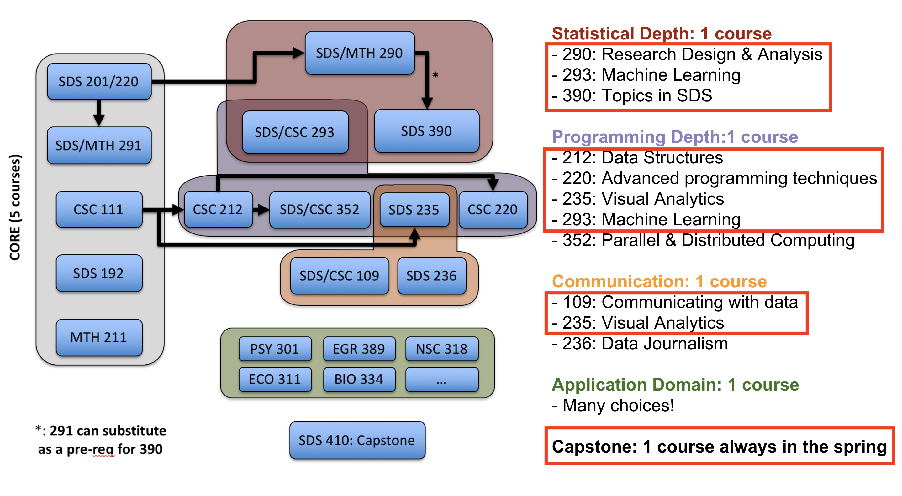{ width=600px }
</center>


## Today's Topics/Activities

### 1. Chalk Talk

Piggy-backing off of last lecture's ModernDive 7.1.1 "Exploratory Data Analysis", fitting and interpreting multiple regression models!


### 2. In-class exercise

* ModernDive 7.1.2: Multiple regression
* ModernDive 7.1.3 & 7.1.4: Fitted/observed values and residuals. Very short. The idea is identical as for basic regression!


***


# Lec 18: Mon 10/22 {#Lec18}

## Announcements

* Office hours this week:
    + Mon 10/22: 3-3:50pm and 5:10-6pm
    + Tue 10/23: 3-4:30pm
* My time at the 2018 Women in Statistics and Data Science conference. See tweets below!
* **Today**: For those of you with a chemistry/biochemistry slant to your studies, my good friend from Middlebury College, Prof. Lesley-Ann Giddings (Smith Class of '05) will be giving a seminar today ["Engineering Novel N5-Hydroxylases to Access Bioactive"](static/giddings_talk.pdf){target="_blank"} from 4-5pm in Ford Hall 240.
* **Tomorrow**: Interested in [majoring in SDS](https://www.smith.edu/statistics/major.php){target="_blank"}? Presentation of the major on Tue 10/23 from 12:15-1:05pm in Ford Hall Atrium.

<center>
{ width=500px }
</center>

## Today's Topics/Activities

### 1. Chalk Talk

* Finishing regression with one categorical explanatory/predictor variable
* Starting regression with **two** numerical explanatory/predictor variables

### 2. In-class exercise

* MD 6.2.3 - 6.2.4: Finishing regression with one categorical explanatory/predictor variable
* MD 7.1.1: Exploratory data analysis of two numerical explanatory/predictor variable:
    + [3D scatterplot](https://beta.rstudioconnect.com/connect/#/apps/3214/){target="_blank"}
    + Code to create above scatterplot [here](https://gist.github.com/rudeboybert/9905f44013c18d6add279cf13ab8e398){target="_blank"}


### 3. Tweets of the day: Posters!!!

Ok folks, we're doing **posters** for the your final presentation

<blockquote class="twitter-tweet" data-lang="en"><p lang="en" dir="ltr">Great <a href="https://twitter.com/hashtag/WSDS2018?src=hash&amp;ref_src=twsrc%5Etfw">#WSDS2018</a> morning poster session in a posh setting: the <a href="https://twitter.com/netherlandplaza?ref_src=twsrc%5Etfw">@netherlandplaza</a> Hall of Mirrors! <a href="https://t.co/PH7BdfzHKX">pic.twitter.com/PH7BdfzHKX</a></p>&mdash; Albert Y. Kim (@rudeboybert) <a href="https://twitter.com/rudeboybert/status/1053632304281804800?ref_src=twsrc%5Etfw">October 20, 2018</a></blockquote>
<script async src="https://platform.twitter.com/widgets.js" charset="utf-8"></script>

<blockquote class="twitter-tweet" data-lang="en"><p lang="en" dir="ltr"><a href="https://twitter.com/SmithCollegeSDS?ref_src=twsrc%5Etfw">@SmithCollegeSDS</a> ugrad <a href="https://twitter.com/nat_laboss?ref_src=twsrc%5Etfw">@nat_laboss</a> explaining the components of her structural equation model of mental health to an extra receptive audience <a href="https://t.co/AKxqtLFhmw">pic.twitter.com/AKxqtLFhmw</a></p>&mdash; Albert Y. Kim (@rudeboybert) <a href="https://twitter.com/rudeboybert/status/1053615346240966657?ref_src=twsrc%5Etfw">October 20, 2018</a></blockquote>
<script async src="https://platform.twitter.com/widgets.js" charset="utf-8"></script>

<blockquote class="twitter-tweet" data-lang="en"><p lang="en" dir="ltr">This is what rocking a poster session looks like <a href="https://twitter.com/hashtag/smithieslead?src=hash&amp;ref_src=twsrc%5Etfw">#smithieslead</a> <a href="https://twitter.com/hashtag/wsds2018?src=hash&amp;ref_src=twsrc%5Etfw">#wsds2018</a> <a href="https://t.co/A4QxJ8lwkM">pic.twitter.com/A4QxJ8lwkM</a></p>&mdash; Smith College SDS (@SmithCollegeSDS) <a href="https://twitter.com/SmithCollegeSDS/status/1053076439577309184?ref_src=twsrc%5Etfw">October 19, 2018</a></blockquote>
<script async src="https://platform.twitter.com/widgets.js" charset="utf-8"></script>

<blockquote class="twitter-tweet" data-lang="en"><p lang="en" dir="ltr">Flashback Friday to yesterday when these three <a href="https://twitter.com/SmithCollegeSDS?ref_src=twsrc%5Etfw">@SmithCollegeSDS</a>  students presented their research that started as a project in Prof. <a href="https://twitter.com/bencapistrant?ref_src=twsrc%5Etfw">@bencapistrant</a> ‘s Population Health SDS course last spring. <a href="https://twitter.com/hashtag/WSDS2018?src=hash&amp;ref_src=twsrc%5Etfw">#WSDS2018</a> <a href="https://twitter.com/hashtag/smithieslead?src=hash&amp;ref_src=twsrc%5Etfw">#smithieslead</a> <a href="https://t.co/AEikQ6N3JT">pic.twitter.com/AEikQ6N3JT</a></p>&mdash; Miles Ott 🏳️
🌈 (@Miles_Ott) <a href="https://twitter.com/Miles_Ott/status/1053332331174522880?ref_src=twsrc%5Etfw">October 19, 2018</a></blockquote>
<script async src="https://platform.twitter.com/widgets.js" charset="utf-8"></script>


### 4. More tweets!!! More Smith SDS!!!

<blockquote class="twitter-tweet" data-lang="en"><p lang="en" dir="ltr">Smith College SDS student Emily Daubenspeck presenting joint work with Smithies  <a href="https://twitter.com/CrystalZangZZ?ref_src=twsrc%5Etfw">@CrystalZangZZ</a> and Caterina Baffa on cognitive decline of veterans using BRFSS data <a href="https://twitter.com/SmithCollegeSDS?ref_src=twsrc%5Etfw">@SmithCollegeSDS</a> students are rocking <a href="https://twitter.com/hashtag/WSDS2018?src=hash&amp;ref_src=twsrc%5Etfw">#WSDS2018</a> <a href="https://twitter.com/hashtag/smithieslead?src=hash&amp;ref_src=twsrc%5Etfw">#smithieslead</a> <a href="https://t.co/wc8umbmkdM">pic.twitter.com/wc8umbmkdM</a></p>&mdash; Miles Ott 🏳️
🌈 (@Miles_Ott) <a href="https://twitter.com/Miles_Ott/status/1053000378223091717?ref_src=twsrc%5Etfw">October 18, 2018</a></blockquote>
<script async src="https://platform.twitter.com/widgets.js" charset="utf-8"></script>

<blockquote class="twitter-tweet" data-lang="en"><p lang="en" dir="ltr"><a href="https://twitter.com/smithcollege?ref_src=twsrc%5Etfw">@smithcollege</a> is in the building! If you see us, say hi! <a href="https://twitter.com/hashtag/WSDS2018?src=hash&amp;ref_src=twsrc%5Etfw">#WSDS2018</a> <a href="https://t.co/yvwsD5z0JQ">pic.twitter.com/yvwsD5z0JQ</a></p>&mdash; Smith College SDS (@SmithCollegeSDS) <a href="https://twitter.com/SmithCollegeSDS/status/1052957495407329281?ref_src=twsrc%5Etfw">October 18, 2018</a></blockquote>
<script async src="https://platform.twitter.com/widgets.js" charset="utf-8"></script>


***


# Lab: Thu 10/18 + Tue 10/23 {#lab1}

Materials for Jenny's lab on Data Wrangling are here:

* <a href="static/data_wrangling_lab/verbs_2.pdf" download>PDF slides</a>
* <a href="static/data_wrangling_lab/dplyr_review_firstname_lastname.Rmd" download>`dplyr_review_firstname_lastname.Rmd`</a>
* Solutions: <a href="static/data_wrangling_lab/dplyr_wrangling_review_solutions.Rmd" download>`dplyr_wrangling_review_solutions.Rmd`</a>


***


# Lec 17: Wed 10/17 {#Lec17}

## Announcements

* **No lecture on Friday!**
* Follow what's going on at the [2018 Women in Statistics and Data Science Conference](https://ww2.amstat.org/meetings/wsds/2018/){target="_blank"} on Twitter at:
    + [\@smithcollegesds](https://twitter.com/smithcollegesds){target="_blank"}
    + [\@rudeboybert](https://twitter.com/rudeboybert){target="_blank"}
* PS06 posted.
* Lab materials for Thu 10/18 (tomorrow) and Tue 10/23 are posted above.
* In-class time to work on projects.


***


# Lec 16: Mon 10/15 {#Lec16}

## Announcements


## Today's Topics/Activities

### 1. Chalk Talk

* Least squares line
* Regression with a categorical explanatory variable

### 2. In-class exercise

* MD 6.3.3
* MD 6.2. From the beginning of 6.2 up to and including the end of 6.2.2.


***


# Lec 15: Fri 10/12 {#Lec15}

## Announcements

* Posted (imperfect) grading rubrics underneath each Problem Set on [Problem Sets](PS.html) page:
    + I only have one grader in this course who is an undergrad. Giving detailed feedback is hard; so I ask you to compare your solutions to the posted solutions and do a "self-evaluation." However, you will get lots of feedback at every stage of the project!
    + I need a mechanism for rewarding students who do something "extra" or "exceptional." However this will always be only a small portion of grade. Think of "extra" or "exceptional" this way:
        1. What is a checklist of criteria for a "great" calculus assignment?
        1. What is a checklist of criteria for a "great" essay?
        1. Guess what the term project for this course and hence also all the practice problem sets are more like? A calculus assignment or an essay?
    + Going forward, however, I will post the (imperfect) grading rubric ahead of time. 
    + Keep in mind the problem sets are worth 10% of final grade, and two lowest ones are dropped.
* Added hints to PS05. 
* Where is the final project, and hence the course, heading? Some past final project [examples](term_project.html#past_examples). 
* Please only access ModernDive using the link on the course webpage. Because of webpage problems in the last few weeks, I've had to change where ModernDive was hosted (saved online).
* Upcoming schedule, so plan accordingly:
    + Tonite: Reminder of talk below.
    + Wed 10/17: In-class time to work on projects. Right after lecture I leave for the [2018 Women in Statistics and Data Science Conference](https://ww2.amstat.org/meetings/wsds/2018/conferenceinfo.cfm/){target="_blank"} along with Prof. Miles Ott and a group of Smithies who will be presenting. **I will be too busy to answer Slack questions until Sunday.**
    + Thu 10/18 Lab Sec 05: Jenny will be conducting a `dplyr` review session.
    + Fri 10/19: **No lecture! Project proposal due at 5pm!**.
    + Tue 10/23 Lab Sec 06: Jenny will be conducting a `dplyr` review session.

<center>
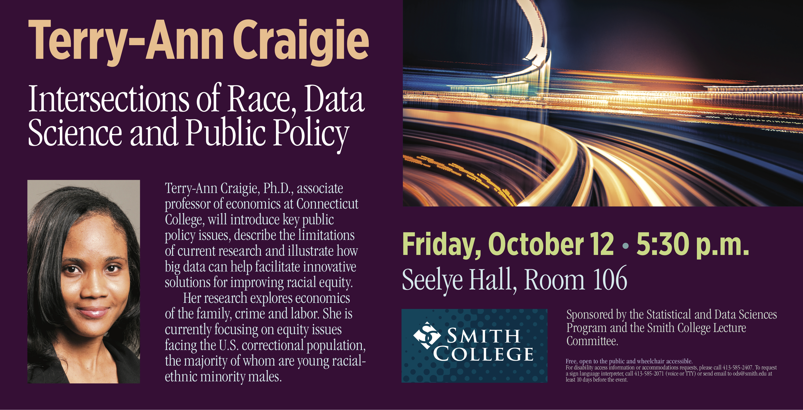{ width=800px }
</center>
<br>


## Today's Topics/Activities

### 1. Chalk Talk

* Refresher on `%>%` and data wrangling verbs (look at cheatsheet).
* Residual analysis.

### 2. In-class exercise

Read ModernDive Chapter 6.1.4 and 6.3.3.


***


# Lec 14: Wed 10/10 {#Lec14}

## Announcements

* Extension on PS04 until ~~5pm~~ 9pm.
* Returned Midterm I
* Go over `PS05.Rmd`


## Today's Topics/Activities

### 1. Chalk Talk

~~Residual analysis.~~

### 2. In-class exercise

~~Read ModernDive Chapter 6.1.4 and 6.3.3.~~

### 3. Tweet of the day

<blockquote class="twitter-tweet" data-lang="en"><p lang="en" dir="ltr">Hey stats+data science educators! Do your students 😱 when seeing 😡 errors, 😡 warnings, 😡 messages in <a href="https://twitter.com/hashtag/rstats?src=hash&amp;ref_src=twsrc%5Etfw">#rstats</a>? In the next update of <a href="https://t.co/LmQoQNNe9r">https://t.co/LmQoQNNe9r</a> in early 2019, they can get 😌 by reading <a href="https://twitter.com/ModernDive?ref_src=twsrc%5Etfw">@ModernDive</a> 2.2.3, just contributed by <a href="https://twitter.com/andrewheiss?ref_src=twsrc%5Etfw">@andrewheiss</a>! <a href="https://t.co/67YzZf7yXU">pic.twitter.com/67YzZf7yXU</a></p>&mdash; ModernDive (@ModernDive) <a href="https://twitter.com/ModernDive/status/1049667413518811137?ref_src=twsrc%5Etfw">October 9, 2018</a></blockquote>
<script async src="https://platform.twitter.com/widgets.js" charset="utf-8"></script>


***


# Lec 13: Fri 10/5 {#Lec13}

## Announcements

* Two `#polls` today:
    + Webpage redesign?
    + Look at tweet of the day below and vote, do you like the building?
* Labs next week: none Tuesday because of break, Thursday lab will take place given that Mountain Day was a Thursday.
* Interested in majoring in SDS? Check out our presentation of the major on Tuesday 10/23 from 12:15-1:05pm in Ford Hall.

<center>
{ width=500px }
</center>  
<br>


## Today's Topics/Activities       

### 1. Chalk Talk

* `get_regression_table()` and `get_regression_points()` wrapper functions
* Looking at ModernDive Figure 6.8
    + Fitted values
    + Residuals

### 2. In-class exercise

Read ModernDive 6.1.3.

### 3. Tweet of the day

Boston University is going to build a new 17-floor "Data Sciences Center" on Commonwealth Avenue, designed to look like a stack of books. `r emo::ji("thumbs up")` or `r emo::ji("thumbs down")`?

<blockquote class="twitter-tweet" data-lang="en"><p lang="en" dir="ltr">Boston University unveils plans for book-inspired data sciences center on Comm. Ave. <a href="https://t.co/XpnDGATpnE">https://t.co/XpnDGATpnE</a> <a href="https://t.co/A8LMpYoB7K">pic.twitter.com/A8LMpYoB7K</a></p>&mdash; Boston.com (@BostonDotCom) <a href="https://twitter.com/BostonDotCom/status/1047534467257184256?ref_src=twsrc%5Etfw">October 3, 2018</a></blockquote>
<script async src="https://platform.twitter.com/widgets.js" charset="utf-8"></script>


***


# Lec 12: Wed 10/3

## Announcements

* ModernDive learning check solutions for Chapter 4 + 5 now posted in Appendix D. 
* Talk on Friday 10/12 5:30pm in Seelye Hall 106. 

<center>
{ width=800px }
</center>

<br>

## Today's Topics/Activities  

### 1. Chalk Talk

* Correlation coefficient: ModernDive Fig. 6.18
* Fitted regression line: ModernDive Fig. 6.6
* Pseudocode (also see tweet of the day below)

### 2. In-class exercise

* Turn your computer's volume up to the maximum and play [Guess the Correlation](http://guessthecorrelation.com/){target="_blank"}
* Read ModernDive Chapters 6.3.1 and 6.1.2.
* Look at solutions below to "cleaning variable names" exercise from Lec11. What do I do if my data frame has horrible variable/column names? Copy and paste this code into your `scratchpad.R` and run all 4 steps individually. This will help for your projects.

```{r, eval = FALSE, paged.print = FALSE}
# Step 1: Manually create a data frame with ugly names
library(dplyr)
example_data_frame <- data_frame(
  `WEIRD !@$^&*() Variable.name` = c(1, 2, 3),
  `more  WEIRDNESS    %` = c("pamplemousse", "cran-raspberry", "tangerine")
)

# Look at these awful names!
example_data_frame

# Step 2: The janitor package to the rescue!
library(janitor)

# Step 3: Use the clean_names() function in the janitor package to create a new
# data frame with cleaner names
data_frame_with_cleaner_names <- example_data_frame %>% 
  clean_names()

# Step 4: Compare these column names with the ones from above. Much cleaner!
data_frame_with_cleaner_names
```


### 3. Tweet of the day

On writing "pseudocode": a rough outline that is "sort of" like code that outlines the steps of what your code will do. You can think of pseudocode as a "blueprint" of your "building"; before you build your building, you need a plan! Here are examples of "pseudocode" for the data wrangling exercise from Learning Check 5.19 in ModernDive on taking the data in `nycflights13` and computing [Available Seat Miles](https://en.wikipedia.org/wiki/Available_seat_miles){target="_blank"}

<blockquote class="twitter-tweet" data-lang="en"><p lang="en" dir="ltr">Students writing out <a href="https://twitter.com/hashtag/dplyr?src=hash&amp;ref_src=twsrc%5Etfw">#dplyr</a> pseudocode to compute &quot;Available Seat Miles&quot; (✈️ measure of capacity) using <a href="https://twitter.com/hashtag/nycflights13?src=hash&amp;ref_src=twsrc%5Etfw">#nycflights13</a> <a href="https://twitter.com/hashtag/rstats?src=hash&amp;ref_src=twsrc%5Etfw">#rstats</a> package. Not only was most pseudocode good, but many were able to code it up on day 3 of data wrangling! 😮😮😮 <a href="https://t.co/BHozXZWjU0">https://t.co/BHozXZWjU0</a> <a href="https://twitter.com/hashtag/chalktalk?src=hash&amp;ref_src=twsrc%5Etfw">#chalktalk</a> <a href="https://t.co/0mzTYalGXa">pic.twitter.com/0mzTYalGXa</a></p>&mdash; Albert Y. Kim (@rudeboybert) <a href="https://twitter.com/rudeboybert/status/964181298691629056?ref_src=twsrc%5Etfw">February 15, 2018</a></blockquote>
<script async src="https://platform.twitter.com/widgets.js" charset="utf-8"></script>


***


# Lec 11: Mon 10/1

## Announcements

* Office hours this week. Please Slack me if this disrupts your plans.
    + Monday 10/1: ~~3-6pm~~ 2:30-4:30pm
    + Tuesday 10/2: ~~3-6pm~~ 2-4:30pm

    
## Today's Topics/Activities  

### 1. Chalk Talk

* What is modeling?
* What is R Markdown?

```{r, eval=TRUE, cache = TRUE}
library(ggplot2)
library(moderndive)

# Teaching evaluation score
?evals
ggplot(evals, aes(x = score)) +
  geom_histogram(binwidth = 0.25) +
  labs(x = "Teaching score", title = "Fig 1: Teaching evaluation scores at UT Austin")

# Seattle house prices (x-axis in original scale)
?house_prices
ggplot(house_prices, aes(x = price)) +
  geom_histogram() +
  labs(x = "Price USD", title = "Fig 2.a): Seattle House Prices")
```

### 2. In-class exercise: R Markdown

At a couple of steps in this process, you may be asked to install packages. Say yes to all of them. 

1. **Fiddle with RStudio settings**:
    + Go to RStudio menu bar -> Tools -> Global Options... -> R Markdown
    + Uncheck box next to "Show output inline for all R Markdown Documents"
1. **Create new R Markdown `.Rmd` file**:
    + Go to RStudio menu bar -> File -> New File -> R Markdown 
    + Set "Title" to "My first R Markdown report" and "Author" as your name.
1. **"Knit" a report**:
    + Click on the disk icon and save this file as `firstname_lastname` somewhere on your computer. This will create a file called `firstname_lastname.Rmd`
    + Click the arrow next to "Knit" -> "Knit to HTML". An HTML webpage should pop up.
1. **Publish this report on web**:
    + Click on blue "Publish" button on top right
    + If you haven't previously, create an account on Rpubs.com. If you have previously, login.
    + Set "Title" to "My first R Markdown report" and "Slug" to "testing"
    + You should end up with a webpage that looks like this [one](http://rpubs.com/rudeboybert/testing){target="_blank"}.
    + Share the URL (webpage link) to your report to your project groupmates in a Slack DM.
1. **Update your report on web**:
    + Make some trivial change to your `testing.Rmd` file.
    + "Re-knit" your report and make sure your trivial change is reflected.
    + The blue "Publish" button should now read "Republish"
    + Click "Update existing"
    + Share the link to your updated report with your groupmates on Slack!

### 3. In-class exercise: ModernDive

* Read ModernDive from the beginning of Chapter 6 up to and including 6.1.1. Note:
    + Make sure to install all the new packages listed in "Needed Packages".
    + You can skip the DataCamp course for now; this will be assigned later.
* **Learning how to learn**: See if you can figure out how to use the `clean_names()` function referenced below. Ask your seatmates, me or the data assistant for help.

### 4. Tweet of the day

How quickly clean variable names; this might be useful for your projects. 

<blockquote class="twitter-tweet" data-lang="en"><p lang="en" dir="ltr">janitor::clean_names() is 💵💲💰! But wait, there&#39;s more! <a href="https://t.co/Rk1aZRZWq0">https://t.co/Rk1aZRZWq0</a> Thanks <a href="https://twitter.com/samfirke?ref_src=twsrc%5Etfw">@samfirke</a> <a href="https://twitter.com/hashtag/rstats?src=hash&amp;ref_src=twsrc%5Etfw">#rstats</a> <a href="https://t.co/H9Bvde8roy">pic.twitter.com/H9Bvde8roy</a></p>&mdash; Albert Y. Kim (@rudeboybert) <a href="https://twitter.com/rudeboybert/status/963504925744488450?ref_src=twsrc%5Etfw">February 13, 2018</a></blockquote>
<script async src="https://platform.twitter.com/widgets.js" charset="utf-8"></script>

Test this function on `example_data_frame` below:

```{r, eval=FALSE}
library(dplyr)
example_data_frame <- data_frame(
  `WEIRD !@$^&*() Variable.name` = c(1, 2, 3),
  `more  WEIRDNESS    %` = c("pamplemousse", "cran-raspberry", "tangerine")
)
example_data_frame
```


***


# Lec 10

## Announcements

* Office hours today 3-4pm
* Read cover page for midterm on [midterms](midterms.html#midtermI) page.

    
## Today's Topics/Activities  

### 1. Chalk Talk

* From last time: Grouping then summarizing: First `group_by()` to group rows together (the grey, blue, green color assignment) then `summarize()` to get group-by-group summaries (a summary statistic for each color).
* Create new variables using `mutate()`
* Arrange rows using `arrange()` or `arrange(desc())`
* Subset columns with `select()`

### 2. ModernDive Roadmap Update

We just completed "just enough data science" (data visualization and data wrangling) to do the rest of ModernDive. In particular

* Data modeling with the `moderndive` package (top right blue box)
* Statistical inference with the `infer` package (bottom right blue box)

{ width=600px }

For more advanced data visualization and data wrangling, take [SDS 192: Intro to Data Science](https://rudeboybert.github.io/SDS192/#today%E2%80%99s_topicsactivities){target="_blank"}. 

### 3. In-class exercise: ModernDive

As marked in the Schedule at the top of this page, read ModernDive 5.6-5.7, 5.9.1


***


# Lec 9

## Announcements

* Albert extra office hours Thursday 2-4pm in McConnell 215.
* Project proposal [submission format](term_project.html#submission_format) added. Just follow along and replace my example with your work!
* Solutions to PS02 [posted](#PS02_R_solutions)
    + Please download the `PS02_solutions.R` file to your computer and open them in RStudio for a brief in-class discussion.
    + To guarantee the `PS02_solutions.R` file opens in the RStudio app (AKA a car's dashboard) and not the regular R app (AKA a car's engine), don't double-click the `PS02_solutions.R` file directly, but rather go to Files panel of RStudio and find/click/open the file from there.
* Midterm I practice questions discussion. See [midterms](midterms.html#midtermIdiscussion) page.


## Today's Topics/Activities  

### 1. Chalk Talk

**a) Summarizing**: Note "summarise" is the British English spelling of the American English "summarize". Both `summarise()` and `summarize()` work in R. 

| Use any summary function | To `summarize()` data
|:-------------------------|:-------------------------
| { width=400px } | { width=400px }


**b) Grouping then summarizing**: First `group_by()` to group rows together (the grey, blue, green color assignment) then `summarize()` to get group-by-group summaries (a summary statistic for each color).

{ width=600px }


### 2. In-class exercise: ModernDive

As marked in the Schedule at the top of this page, read ModernDive 5.4-5.5


***


# Lec 8

## Announcements

* Lecture on today will start at 1:20pm to give people time to comfortably get from Emily Dodwell's talk listed in [Lec06](#Lec06).
* Visitor: [Data Counselor Raul Zelada Aprili](https://www.smith.edu/qlc/tutoring.html?colDataCnslr=open#PanelDataCnslr){target="_blank"}
* Submission format for Term Project Proposal on Wednesday.
* Discussion on Midterm I. See [Midterms](midterms.html#midtermI) page.
* Lab tomorrow/Thursday
    + Jenny will go over a [data viz recap lab](static/data_vis_lab/lab4_source_JS_SDS220b.html){target="_blank"} which will be helpful for Midterm I studying.
    + After that you can work on Problem Sets.
    + However you allocate your time, Jenny and I ask you stay until the end of lab period as getting up and leaving is very disruptive. For example, we suggest you do exercises in [DataCamp Practice Mode](https://www.datacamp.com/community/blog/introducing-daily-practice-mode){target="_blank"} to reinforce what you've already learned!


## Today's Topics/Activities  

### 1. Chalk Talk

* Coding functions: arguments as inputs
* `%>%` is the "pipe" operator, pronouned "then"
* First data wrangling "verb": `filter()` to subset rows:

{ width=600px }

### 2. In-class exercise: ModernDive

As marked in the Schedule at the top of this page, read ModernDive 5-5.3

### 3. Tweet of the day

While networking may come naturally to some, it doesn't to most. It takes work, courage, and practice! For example, start small & low risk! A simple tweet can be the beginning of a meaningful relationship!

<blockquote class="twitter-tweet" data-lang="en"><p lang="en" dir="ltr">It was great finally meeting you IRL too after all this time of virtual acquaintance! It&#39;s nice knowing you are real person and not just a sequence of 0&#39;s and 1&#39;s 🤖🤖🤖</p>&mdash; Albert Y. Kim (@rudeboybert) <a href="https://twitter.com/rudeboybert/status/1044007729172545542?ref_src=twsrc%5Etfw">September 23, 2018</a></blockquote>
<script async src="https://platform.twitter.com/widgets.js" charset="utf-8"></script>


***


# Lec 7

## Announcements

* Go over questions in `#random` Slack channel
* Monday is Midterm I review
* ModernDive Learning Check solutions are ~~directly under question statement~~ now all in [Appendix D](https://moderndive.netlify.com/d-appendixd){target="_blank"} at the back of the book.
* Lecture on Monday will start at 1:20pm (10 minutes later) to give people time to comfortably get from Emily Dodwell's talk listed in [Lec06](#Lec06) to class.
* Next step of Term Project: [Project proposal](term_project.html#proposal) due Friday 10/19
* **Videoconferencing**: In Slack, in a Direct Message, type `/appear SOME_UNIQUE_NAME_ONLY_YOU_WOULD_THINK_OF`

## Todays Topics/Activities  

### 1. Chalk Talk

* Finish data visualization. Table in ModernDive Chapter 3.9
* Ink/information ratio
* Secret to mastering packages

### 2. Project Time

Start your projects!

### 3. Tweet of the day

ModernDive co-author Chester Ismay [\@old_man_chester](https://twitter.com/old_man_chester){target="_blank"} is Senior Curriculum Lead at DataCamp. If you are curious for a "big picture" view of why we are using DataCamp, read the linked blogpost, in particular look at the image of the "data science pipeline". Remember, you have free access to **all** DataCamp courses for 6 months!

<blockquote class="twitter-tweet"><p lang="en" dir="ltr">Read this blog post by <a href="https://twitter.com/old_man_chester?ref_src=twsrc%5Etfw">@old_man_chester</a> to learn about our new Tidyverse Fundamentals with R Skill Track! In this track, you’ll learn the skills needed to get you up and running with data science in R using the <a href="https://twitter.com/hashtag/tidyverse?src=hash&amp;ref_src=twsrc%5Etfw">#tidyverse</a>. <a href="https://t.co/4fqAdJgoTX">https://t.co/4fqAdJgoTX</a> <a href="https://t.co/RsYxe4Hpm5">pic.twitter.com/RsYxe4Hpm5</a></p>&mdash; DataCamp (@DataCamp) <a href="https://twitter.com/DataCamp/status/1042851042139025409?ref_src=twsrc%5Etfw">September 20, 2018</a></blockquote> <script async src="https://platform.twitter.com/widgets.js" charset="utf-8"></script>


***


# Lec 6 {#Lec06}

## Announcements

* Curious about a career in data science? Then come for Emily Dodwell (class of 2011)'s talk "The Nuts and Bolts of a Data Science Career" on Monday 9/24; stay for the `r emo::ji("pizza")` lunch! Click [here](static/dodwell_talk.pdf){target="_blank"} for flyer.
* Problem set 2 posted [below](#PS02).
* Upcoming "Important dates" in schedule above:
    + [Project groups](term_project.html#groups) by this Friday 9/21
    + Self-scheduled Midterm I weekend of Friday 9/28
* Learning check solutions by Friday, I promise!
* Slack poll on `scratchpad.R`


## RStudio Desktop

In this week's lab sections you’ll get help installing R + RStudio on your computers; the instructions are in ModernDive 2.1.1. **Starting on Friday I will assume you are all using the desktop version of RStudio.** If you're still curious about RStudio Server & RStudio Cloud, check out these [notes](notes.html#server_cloud).

So after Friday you'll be responsible for installing R Packages as described in ModernDive 2.3. In other words, to use a package for the first time:

1. You'll need to install it once.
1. *Load/open* it using `library()` command. Ex: `library(nycflights13)`

## Todays Topics/Activities       

### 1. Chalk Talk: Histograms "binning" structure

Comparing Figures 3.10 and 3.11 in the ModernDive readings from Lec 5

```{r, eval=FALSE, echo=TRUE}
library(ggplot2)
library(nycflights13)
# Code to generate Fig 3.10 with bar border color white
ggplot(data = weather, mapping = aes(x = temp)) +
  geom_histogram(color = "white")
# Code to generate Fig 3.11
ggplot(data = weather, mapping = aes(x = temp)) +
  geom_histogram(bins = 60, color = "white")
```
```{r, eval=TRUE, echo=FALSE, cache=TRUE}
library(ggplot2)
library(nycflights13)
library(patchwork)
# Code to generate Fig 3.10
p1 <- ggplot(data = weather, mapping = aes(x = temp)) +
  geom_histogram(color = "white") +
  labs(title = "Fig 3.10: 30 bins")
# Code to generate Fig 3.11
p2 <- ggplot(data = weather, mapping = aes(x = temp)) +
  geom_histogram(bins = 60, color = "white") +
  labs(title = "Fig 3.11: 60 bins")
p1 + p2
```


### 2. Chalk Talk: Boxplots

```{r, eval=TRUE, echo=FALSE, cache=TRUE}
library(ggplot2)
library(dplyr)
example <- data_frame(
  values = c(1, 3, 5, 6, 7, 8, 9, 12, 13, 14, 15, 30)
)
```

Say we want to plot a boxplot of the following `r nrow(example)` values which are pre-sorted: 

> `r example %>% pull(values)`

They have the following *summary statistics*:


Min. | 1t Qu. | Median  | 3rd Qu.  |  Max. 
---- | ------- | ------  |  ------- | --- 
`r min(example$values)`  |  `r quantile(example$values, probs=0.25, type = 2)` |  `r median(example$values)`  |  `r quantile(example$values, probs=0.75, type=2)`  | `r max(example$values)`


Let's copare the points and the corresponding boxplot side-by-side with the values on the $y$-axis matching:

```{r, echo=FALSE, eval=TRUE, cache=TRUE}
plot1 <- ggplot(example, aes(x=factor(1), y=values)) +
  geom_point() +
  labs(title = "Points") +
  theme(
    axis.title.x = element_blank(),
    axis.text.x = element_blank(),
    axis.ticks.x = element_blank()
  )

plot2 <- ggplot(example, aes(x=factor(1), y=values)) +
  geom_boxplot() +
  labs(title = "Boxplot") +
  theme(
    axis.title.x = element_blank(),
    axis.text.x = element_blank(),
    axis.ticks.x = element_blank()
  )
plot1 + plot2
```


### 3. In-class exercise: ModernDive

As marked in the Schedule at the top of this page, read ModernDive 3.7.

### 4. Tweet of the day

On *imposter syndrome* is a psychological pattern in which an individual doubts their accomplishments and has a persistent internalized fear of being exposed as a "fraud". Click below to read full thread.

<blockquote class="twitter-tweet" data-lang="en"><p lang="en" dir="ltr">Let&#39;s talk about imposter syndrome in tech -- specifically, ways we can combat it better, both individually and as a community (a thread) 👇</p>&mdash; Caitlin Hudon👩🏼
💻 (@beeonaposy) <a href="https://twitter.com/beeonaposy/status/1042161720771395585?ref_src=twsrc%5Etfw">September 18, 2018</a></blockquote>
<script async src="https://platform.twitter.com/widgets.js" charset="utf-8"></script>

Interesting results from my SDS 192 course earlier today:

{ width=500px }


***


# Lec 5

## Experimenting with RStudio Cloud

Experimenting with [RStudio Cloud](https://www.causeweb.org/cause/sites/default/files/eCOTS%202018%20-%20Frictionless%20onboarding%20to%20data%20science%20with%20RStudio%20Cloud.pdf){target="_blank"} (on RStudio's servers) instead of RStudio Server (on Smith College's Servers).

* Click [here](https://rstudio.cloud/spaces/4441/join?access_code=KMu7j8TpEMdb1XCXB9Dbj%2B8%2F79dQaS1nchX2PCtO){target="_blank"} to join RStudio Cloud.
* Create an account by clicking the "Login with Google" button and use your Smith email.
* Give yourself whatever login name.
* In the "2018-09 SDS 220" space you should see a "coursework" project. Click on "Copy".
* Click where it says "coursework" and rename it "Firstname Lastname". For example in my case "Albert Kim".

## Announceme
nts

* Lab section Tuesday/Thursday:
    + Install R + RStudio on your computer
    + Start Problem set 2
* What my `scratchpad.R` looks like after Lec4. Yours shouldn't be *exactly* the same, but close.  
Note because I saved my work, `scratchpad.R` is written in black. If I had unsaved work, this would be written in red.  
{ width=500px }

## Today's To
pics/Activities       

### 1. Chalk Talk

* Histograms visualize the *(empirical) distribution* of a numerical variable
* Facets + Histograms: Allow you to visualize *the conditional distribution* of a numerical variable

### 2. In-class exercise: Comment lines

In the screen shot of my `scratchpad.R` above, any line that starts with a `#` are called *comment lines*. They are ignored by R when you run them in the console. Run both these lines in the console separately:

```{r, eval=FALSE, echo=TRUE}
this is a comment line that R ignores that helps readers (including you!) understand code

# this is a comment line that R ignores that helps readers (including you!) understand code
```

Why does one line return an `Error` whereas the other doesn't?

### 3. In-class exercise: ModernDive

As marked in the Schedule at the top of this page, read ModernDive 3.5 and 3.6.


***


# Lec 4

## Announcements

* **Extra office hours today 3:30-5pm in McConnell 215**
* For those of you with interests in Biology: Reed College's Prof Derek Applewhite ["The Spatial and Temporal Regulation of Non-muscle Myosin II Contractility"](https://twitter.com/rudeboybert/status/1040272556991959041){target="_blank"} talk on Monday afternoon.
* Syllabus:
    + Added expectations to [Basic Information](syllabus.html#basicinfo) section.
    + Added note about when to do DataCamp courses to [syllabus](syllabus.html#datacamp): *You do not need to complete any DataCamp courses in preparation for future lectures; they will always be explicitly assigned and you will subsequently be given time during Tu/Th lab sections to do them.*
* Solutions to previous lecture's learning checks will be posted directly underneith question. Ex: Look at [LC2.1 Solutions](https://moderndive.netlify.com/2-getting-started.html#exploredataframes){target="_blank"} I just posted.


## Today's Topics/Activities       

### 1. Chalk Talk

The Grammar of Graphics: the theoretical underpinnings of statistical graphics.

### 2. In-class exercise: R code scratchpads

**Question**: Should I be copying/pasting/tweeking code directly in the console window?  
**Answer**: You can, but it makes saving work difficult. Instead, create a "scratchpad":

1. Create a new `.R` script: In RStudio Menu Bar -> File -> New File -> R Script. 
1. Save this as `scratchpad.R`
1. Copy/paste/tweak any code in your scratchpad, not in console window. For example, for this exercise write: `1+1`
1. To "run" code in the console (in other words tell R to "do this"), you can do one of the following:
    1. Copy it from scratchpad, then paste it in console, then hit enter.
    1. Highlight the code you want to run, then click on "Run"
    1. Highlight the code you want to run, then press control+enter on Windows/Unix/Chromebook or ⌘+enter on macOS.
1. Save and close the file.
1. In the Files panel, click on `scratchpad.R` to reopen your previously saved work.

### 3. In-class exercise: ModernDive

As marked in the Schedule at the top of this page, read ModernDive 3-3.3.1 (start of Chapter 3 to the end of 3.3.1).

* Do not ignore the "Needed Packages" section at the beginning. Recall:
    + The phone vs app analogy described in ModernDive 2.3.
    + If you are using RStudio Server in your browser, these packages come pre-installed.
    + If you are using RStudio Desktop installed on your computer, you'll have to ensure these packages are installed.
* Please skip the "Introduction to the Tidyverse" DataCamp course mentioned at the beginning of Chapter 3 for now.
* "Learning checks": These are practice problems that you do not need to submit. Should you write your answers down? If you feel like you would benefit, then yes! I will post solutions to the learning checks before the next lecture!
* **Note**: In this class, of the "Five Named Graphs" described in ModernDive 3.2, we'll only cover scatterplots, histographs, and boxplots; we'll be skipping linegraphs and barplots. 


***


# Lec 3

## Announcements

* Go over previous Slack `#general_announcements`
* If you haven't already, **please** complete the [Intro Survey](https://docs.google.com/forms/d/e/1FAIpQLSd7Ozr9tVcHG9Ho9ijEjQZjncLSLD5pYYfKjURbWIrIrvbDPg/viewform){target="_blank"} from Lec 1.
* Self-scheduled Midterm II has been moved from Fri 10/26 thru Sun 10/28 to Fri 11/2 thru Sun 11/4 because of family weekend. 
* Syllabus:
    + Added full topic schedule
    + Added office hours
    + Added "Expectations" to following sections: [Topic Schedule and Readings](syllabus.html#topicschedule), [Evaluation](syllabus.html#topicschedule), [Accommodations](syllabus.html#accommodations), [Code of Conduct](syllabus.html#codeofconduct)
* **Extra office hours: Friday 9/14, 3:30-5pm in McConnell 215**

## Today's Topics/Activities       
        
1. Go over ModernDive Chapter 2. Note:
    + You can skip all videos and linked DataCamp courses.
    + "Learning checks": These are practice problems that you do not need to submit. Should you write your answers down? If you feel like you would benefit, then yes! I will post solutions to the learning checks before the next lecture!

## Getting help

A big part of learning data science tools is learning how to get help effectively. For example, in this course:

**In class**:

1. Ask yourself "Is this something I can Google?" Learning to use Google effectively is an important tool in a data scientist's toolbox.
1. Ask the people sitting next to you. 
1. Raise your hand to ask the data assistant or myself.

**Outside of class**:

1. Ask yourself "Is this something I can Google?" Learning to use Google effectively is an important tool in a data scientist's toolbox.
1. Ask yourself "Are there people I work with in class that I can Slack?"
1. If you all don't know, post a question on Slack in the `#r_questions` channel.
1. Visit the Spinelli Center for tutoring Sunday-Thursday 7-9pm (see [syllabus](syllabus.html#basicinfo) for more info).


***


# Lec 2

1. **Slack**
    + I've separated our class Slack team from the previous one. Please join the new one by clicking [here](https://join.slack.com/t/sds-mth-220-fall2018/shared_invite/enQtNDMxNjc2ODM2Njg4LWQ1ODY3NDNiYTYzYTU5NTA2YWRlODkwNThhZDE4MjQwMjk1NzZlYmYxYjU4ZjI4N2MxNWVhYjg3NjEzYzk4YjY){target="_blank"}.
    + Practice sending [formated messages](https://get.slack.help/hc/en-us/articles/202288908-Format-your-messages){target="_blank"} to a classmate.
1. **Getting started with data in R**
    + Click "R" in the menu bar above to open RStudio Server to use R in your web-browser.
    + Click on ModernDive above and read Chapter 2: Getting started with data.
        + You don't need to watch the videos for now
        + If you are using RStudio Server, you don't need to install packages. However, you will need to load them.
        + Learning checks: These are practice problems to reinforce your learning. You do not need to submit today's learning checks.
1. **Lab Tuesday/Thursday** Start the DataCamp portion of Problem set 1. Jenny will help you get used to the DataCamp interface. 


***


# Lec 1

* What is inference demo.
* From the ModernDive [Introduction for Students](https://moderndive.netlify.com/index.html#sec:intro-for-students){target="_blank"}: { width=600px }
* It all builds up to the `infer` package for "tidy" statistical inference. Only if you're curious:
  + [Package homepage](http://infer.netlify.com/){target="_blank"}
  + [High-level talk of package](https://www.rstudio.com/resources/videos/infer-a-package-for-tidy-statistical-inference/){target="_blank"}. 


## TODO's {#Lec1TODO}

* **Make sure**:
    + You can login to RStudio Server (click R icon in menubar above).
    + You are part of the class Slack team (click hashtag icon in menubar above) and 
        1. Have added a profile picture
        1. Can see the ~`#220_intro_stats`~, `#moderndive_typoes`, `r_questions`, and `random` channels
        1. Have turned on [email notifications](https://get.slack.help/hc/en-us/articles/201355156-Guide-to-Slack-notifications-#email-notifications){target="_blank"}
    + You have received an invitation email to DataCamp and are a member of the [group](https://www.datacamp.com/enterprise/2018-09-sds220-intro-to-probability-statistics){target="_blank"}. Do not create an account separately on datacamp.com, but rather use the link in the email you received.
    + You've completed the [Intro Survey](https://docs.google.com/forms/d/e/1FAIpQLSd7Ozr9tVcHG9Ho9ijEjQZjncLSLD5pYYfKjURbWIrIrvbDPg/viewform){target="_blank"}
* **Need help with any of the above?** ~~Fill out this [Google Form](https://docs.google.com/forms/d/e/1FAIpQLSehdLkV7PPj2_ghaHROdqb4fRCdJDv0ksDLoMw95WpPnfxzqQ/viewform){target="_blank"}~~ Slack me!

-->
