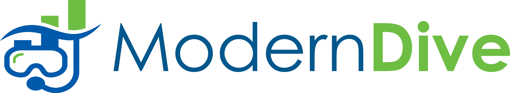

```{r, include=FALSE}
knitr::opts_chunk$set(echo=TRUE, message=FALSE, warning=FALSE, eval=FALSE, 
                      cache=TRUE, fig.width=16/2, fig.height=9/2)
# Set seed value of random number generator to get "replicable" random numbers.
# Why 76? Because of https://www.youtube.com/watch?v=xjJ7FheCkCU
set.seed(76)
```

<style>
h1{font-weight: 400;}
</style>

# Basic information {#basicinfo}

* **Course title:** SDS/MTH 220: Introduction to Probability and Statistics
* **Instructor:** [Albert Y. Kim](https://rudeboybert.rbind.io/) - Assistant Professor of Statistical & Data Sciences
* **~~Email:~~ Slack team**: Click hashtag icon in navbar for the browser interface or use the [desktop app](https://slack.com/downloads/){target="_blank"}.
* **Meeting locations/times:** 
    + **Lectures**: MWF 11:00-12:10 - Sabin-Reed 301
    + **Labs**: Held by Dr. Jenny Smetzer (Note lab end times are incorrectly listed on Course Search)
        + Sec 01: Tue 1:00-2:20 - Sabin-Reed 301
        + Sec 02: Tue 3:00-4:20 - Sabin-Reed 301
* **Outside help**:
    + The `#questions` channel on Slack.
    + Spinelli Center for Quantitative Learning [Tutoring](https://www.smith.edu/qlc/tutoring.html?colStats=open#PanelStats){target="_blank"}: Sunday thru Thursday 7-9pm in Sabin-Reed 301. 
    + Albert's office hours in McConnell Hall 215: Mon & Wed 2:45-4:00 and by apppointment (click [here](https://calendar.google.com/calendar/selfsched?sstoken=UVBidEVzZlJ3a2dYfGRlZmF1bHR8NmExNDk4OGM5ZWZiYWNmOWYxYWRkZDM0NmU3ZGRmMzE){target="_blank"} to book). **If you're having R or RStudio issues, please have your computer and RStudio loaded and ready to go.**
    + Jenny's office hours in Bass 403: By apppointment on Tu 11:00-12:20 and Wed 10:00-12:20 and 1:00-2:00 (click [here](https://jennysmetzer.youcanbook.me/){target="_blank"} to book).
    + Spinelli Center Data Counselor Vahab Khademi in Seelye 207: By appointment (click [here](https://www.smith.edu/qlc/tutoring.html?colDataCnslr=open#PanelDataCnslr){target="_blank"} to book).


## Instructor work-life balance

* I will respond to Slack messages sent during the week within 24h. I will respond to Slack messages sent during the weekend at my own discretion.
* If possible, please only Slack me with briefer and administrative questions; I prefer having more substantive conversations in person as it takes me less energy to understand where you are at.
* I will do my best to return all grading as promptly as possible.
* I will rarely be on campus on Thursdays as this is my self-care day.


***


# How can I succeed in this class? {#succeed}

Ask yourself:

* **When I have questions or don't understand something:**
    + *"Am I asking questions in class?"*
    + *"Am I asking questions on Slack in `#questions`?"* Even better: *"Am I answering my peers' questions on Slack?"*
    + *"Having I been going to the Spinelli tutoring center?"*
    + *"Have I been coming to Albert or Jenny's office hours?"*
* **Lectures, labs, and readings:**
    + *"Am I staying on top Slack notifications sent between lectures?"* If you need help developing a notification strategy that best suits your lifestyle, please speak to me. 
    + *"Am I attending lectures consistently?"*
    + *"Am I actually running the code and studying the outputs in R during in-class exercises, or am I just skimming the text?"*
    + *"Am I completing all the ModernDive readings/in-class activites for a given lecture before the start of the next lecture?"*
    + *"During in-class exercises and lab time, am I taking full advantage that I'm in the same place at the same time with the instructor, the lab assistants, and most importantly your peers, or am I browsing the web/texting the whole time?"*
* **Problem sets, DataCamp, and coding:**
    + *"Am I actually doing the problem sets?"*
    + *"Have I been attempting a good faith balance between to push myself during DataCamp exercises while not banging my head on the wall, or am I just taking the hints/solutions without any effort?"*
    + *"When learning to code, much like learning a language, have I been really pushing myself to practice, practice, practice?"*


***


# Course Description & Objectives

* **Official course description**: On [Smith College
Course Search](https://www.smith.edu/academics/academic-program/curriculum/course-search?term=Spring+2019&dept=&instr=Albert+Y.+Kim&credits=&course_numb=220&course_keywd=&op=Submit&form_build_id=form-denY7g_Jg58ti6JEd7MQqOj4CvHwIw6awhXG9B0jLHs&form_id=campus_course_search_basic_search_form){target="_blank"}.
* **Objectives**: This semester you will
    1. Learn statistical inference via data science, not mathematics/probability theory.
    1. Engage in the data/science research pipeline in as faithful a manner as possible while maintaining a level suitable for novices.
    1. Develop your statistical literacy, a necessary ability for effective citizenship.


***


# Topic Schedule and Readings {#topicschedule}

<center>
{ width=700px }
</center>

</br>

A rough topic schedule and corresponding readings are posted below on the [main page](index.html) of this course webpage. We will draw from the following sources:

1. [Statistical Inference via Data Science: A moderndive into R and the tidyverse](https://moderndive.netlify.com/){target="_blank"}. We'll be using the development version; click link in menubar above. Follow the book on Twitter [\@ModernDive](https://twitter.com/ModernDive){target="_blank"}.
1. [OpenIntro: Introductory Statistics with Randomization and Simulation](https://www.openintro.org/stat/textbook.php?stat_book=isrs/){target="_blank"} by Diez, Barr, and Cetinkaya-Rundel
    + Free [PDF](https://www.openintro.org/download.php?file=isrs1_tablet&referrer=/stat/textbook.php){target="_blank"}
    + Hardcopy. Available for $8.49 on [Amazon](https://www.amazon.com/Introductory-Statistics-Randomization-Simulation-David/dp/1500576697/ref=pd_sbs_14_2?_encoding=UTF8&pd_rd_i=1500576697&pd_rd_r=8a25adfe-b61a-11e8-8e51-357518f34f72&pd_rd_w=SqIFV&pd_rd_wg=mb7dk&pf_rd_i=desktop-dp-sims&pf_rd_m=ATVPDKIKX0DER&pf_rd_p=53dead45-2b3d-4b73-bafb-fe26a7f14aac&pf_rd_r=83CCQTHW3KV5NTNHT22J&pf_rd_s=desktop-dp-sims&pf_rd_t=40701&psc=1&refRID=83CCQTHW3KV5NTNHT22J){target="_blank"}
1. DataCamp: an online interactive environment for learning data science currently via R and Python. On top of the DataCamp courses we'll cover this semester, you have free access to [all their courses](https://www.datacamp.com/courses/all){target="_blank"} for 6 months. 

## Policies

* Bring your laptop, a set of headphones, colored pens/pencils, and your paper notebook to every lecture.   
* You are expected to stay until the end of lecture. If you need to leave before the end of lecture, please confirm with me first.
* Attendance will not be explicitly taken and occasional absenses are excused. However, extended absenses should be mentioned to me.
* However, you are responsible for asking your peers for what you missed. For example, makeup lectures will not be held during office hours.


***  


# Evaluation

## Weekly Problem Sets 15%

* Total of 9 problem sets: assigned just after Monday's class at 11am, due the following week at 9am.
* Each problem set is worth 100 pts for a total of 900 possible pts, however the final computation will be out of **700 pts**. 
* This means that you can decide to not hand in 2 problem sets any reason. It could be because you are ill, you forgot about the assignment, or you had too much work for your other courses. *Note that pre-planned “dropping” of labs should be used sparingly because we can not predict when life will happen (ie. illness, etc).* Alternatively, you could hand in all the problem sets and allow for smaller mistakes on each one to effectively be "waved."
* The problem sets in this class should be viewed as low-stakes opportunities to
practice, instead of evaluative tools used by the instructor to assign grades.
**Each problem set is worth less than 2% of your final grade**.

<!--## DataCamp Assignments 5% {#datacamp}

* Assigned during Tuesday labs, due the following week.
* DataCamp is meant to be low stakes-practice, so the only thing that matters for your grade is whether you complete the course. So while things like the number of hints/solutions taken don't factor into your grade, it is important to make a good faith effort to answer these questions the best you can.
* While you may do them in advance if you are curious, it is most definitely not required. Note that the DataCamp schedule may change, with certain courses dropped/added.
* Jenny will talk more about DataCamp during Lab 2.


* Taking notes based on what you cover is not required, but please do so if you feel you will benefit. 
* I *expect* most people to take no more than 4 hours per DataCamp assignment.
* Please note retention of the material will not be perfect the first time through. The only way to really retain the material is via lots of practice/doing. For now, think of this as a introduction.


## Quizzes 5%

There will be 2-3 quizzes assigned during the course of the semester. They will always be announced beforehand. 
-->

## Term Project 30% {#termproject}

See [Term Project](term_project.html) page. While your term project grade is only based on your final resubmission on the last day of class, your level of contributions at all the intermediate steps (data, proposal, and initial submission) will affect your engagement grade; see [Engagement](#engagement) below.

## Badge Challenges: 45%

* There will be four self-scheduled badge challenges, including one during finals week, during which you can collect statistics badges. See the [Midterms](midterms.html) page.
* There are 15 badges, each representing core skills for the course. During each badge challenge, you can attempt as many or as few badges as you would like. **Your goal, by the end of the semester, is to collect all 15 badges.**
* The first badge challenge will have the first 5 badges available, the second will have the first 10, and the third and fourth badge challenge will have all 15 badges. As a reminder, you do *not need to (nor should you) attempt* all badges on each challenge, but you do need to collect all 15 badges by the end of the term. 
* There are four levels for each badge: **G** – Gold, **S** – Silver, **B** – Bronze, and **X** – cannot be assessed. 
* The most recent level for each badge is the recorded level. This means that if you earn a gold level for badge 1 on the first challenge, then you never have to attempt this badge again. But, if you earn silver for badge 4 on the first challenge and then a bronze for badge 4 on the second challenge, your current level for badge 4 is bronze. 
* This system allows for you to iteratively improve your statistical skills throughout the semester. Each badge challenge is an opportunity for you to practice the *only* the statistical skills that you are ready to demonstrate. 

At the end of the semester, your collected badges and badge levels will be converted into points for your final grade:


## Engagement 10% {#engagement}

Being part of a professional community has many parts; we generate and 
consume knowledge, we review and critique work, and we present to and 
learn from each other. The edge of what we know is constantly being pushed
further and further as we discover new ideas, create new knowledge, and 
ask new questions. At times, we are computers, writers, and contractors, 
and then at other times, we serve as reviewers, mentors, and learners. The 
constancy is our willingness to be present and active within our professional 
community. With this in mind, in this course, your participation is expected, 
especially *you'll only get out of this class as much as you put in*. That 
being said, here are multiple pathways for you to stay engaged in this class:

Participation can take many forms, including but not limited to: attending 
class meetings, being active on our course slack, participating in discussion 
in class, offering ideas and questions in class or on slack. Beyond attending 
class, our class as a community will generate a list of what we believe are 
ways to engage and participate in our course. Adding to this list one way 
that you are called to participate in this course. If you find yourself unwilling 
or resistant to adding to this list, examine this. *What is holding you back?* 
*What would help propel you to action?*

The engagement part of the course will be graded with student input. In the week 
before spring break and during the last week of classes, you will be asked to 
complete a self-evaluation of your class engagement in context of the class 
engagement list. Your self-evaluations will be a critical part of determining 
this section of your grade, but not the only determining factor. 

## Policies

1. **Collaboration**: While we encourage you to work with your peers for problem
sets and labs, you must submit your own answers and not simple rewordings of
another's work. Furthermore, all collaborations must be explicitly acknowledged
in your submissions.
1. **Honor Code**: All your work must follow the [Smith College Academic Honor
Code Statement](https://www.smith.edu/sao/handbook/socialconduct/honorcode.php){target="_blank"};
in particular all external sources must be cited in your submissions.
1. **Problem sets**:
    + No extensions will be granted without a dean's note.
    + To receive full credit, you must show your work and explain your reasoning in your solutions. 
    + All written problem sets must be handed in by 9am on Mondays on Gradescope. No emailed submissions will be accepted. 
1. **Badgea Challenges**:
    + No make-up badge challenges will be allowed without a dean's note. 
    + Timestamps for all midterms will be strictly enforced.
1. **Grading**: We reserve the right to not discuss any grading issues in class and instead direct you to office hours or class. 


***


# Accommodations {#accommodations}
 
Smith is committed to providing support services and reasonable accommodations to all students with disabilities. To request an accommodation, please register with the Disability Services Office at the beginning of the semester. To do so, call 413.585.2071 to arrange an appointment with Laura Rauscher, Director of Disability Services.


***


# Code of Conduct {#codeofconduct}

As the instructor and assistants for this course, we are committed to making
participation in this course a harassment-free experience for everyone,
regardless of level of experience, gender, gender identity and expression,
sexual orientation, disability, personal appearance, body size, race, ethnicity,
age, or religion. Examples of unacceptable behavior by participants in this
course include the use of sexual language or imagery, derogatory comments or
personal attacks, trolling, public or private harassment, insults, or other
unprofessional conduct.

As the instructor and assistants we have the right and responsibility to point
out and stop behavior that is not aligned to this Code of Conduct. Participants
who do not follow the Code of Conduct may be reprimanded for such behavior.
Instances of abusive, harassing, or otherwise unacceptable behavior may be
reported by contacting the instructor.

**All students, the instructor, the lab instructor, and all assistants are
expected to adhere to this Code of Conduct in all settings for this course:
lectures, labs, office hours, tutoring hours, and over Slack.**

This Code of Conduct is adapted from the [Contributor
Covenant](http://contributor-covenant.org){target="_blank"}, version 1.0.0,
available [here](http://contributor-covenant.org/version/1/0/0/){target="_blank"}.


***


<!--

# Signature

*I have read this syllabus in its entirety.*


Signature:  

***


Printed name:  

***


Date:  


***


-->


